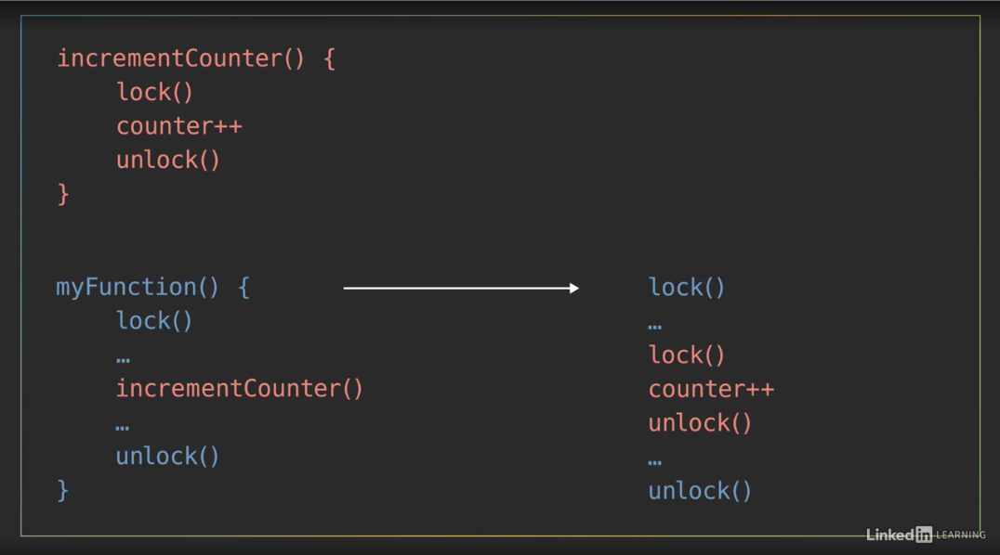
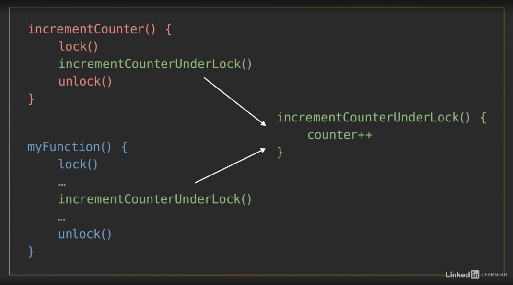

# Parallel and Concurrent Programming with Java 1
## Intro
## 1 Parallel Computing Hardware
### Sequential vs. parallel computing
Sequential
* simple straight forward
* not taking advantage of the parallel hardware
Parrallel
* Higher throughput: 
    - same task faster
    - or more tasks in same time
* need extra effort for coordination

### Parallel computing architectures

One of the most widely used systems for classifying multiprocessor architectures is Flynn's taxonomy,

#### Flynn's taxonomy

Flynn's taxonomy distinguishes four classes of computer architecture based on two factors
* the number of concurrent instruction or control streams
* the number of data streams

The class names are usually written as four letter acronyms that indicate whether they have single or multiple instruction streams and data streams
* SIMD stands for Single Instruction, Multiple Data.
* The simplest of these four classes is the **Single Instruction, Single Data** or **SISD** architecture, which is __a sequential computer with a single processor unit__.
* The next class in Flynn's taxonomy is **Single Instruction, Multiple Data**, or **SIMD**, which is a type of parallel computer with multiple processing units. All of its processors execute the same instruction at any given time, but they can each operate on different data element. *As an SIMD computer, our two processors are both executing the same chopping instruction, but I'm chopping celery as my data while Baron chops a carrot. - And we'll execute those instructions in sync with each other. (chopping)* **This type of SIMD architecture is well-suited for applications that perform the same handful of operations on a massive set of data elements** like image processing. And most modern computers use graphic processing units or **GPUs** with SIMD instructions to do just that.
* **Multiple Instruction, Single Data** or **MISD** architecture, each processing unit independently executes its own separate series of instructions. However, all of those processors are operating on the same single stream of data. **MISD doesn't make much practical sense, so it's not a commonly used architecture.**
* **Multiple Instruction, Multiple Data** or MIMD computer, every processing unit can be executing a different series of instructions, and at the same time, each of those processors can be operating on a different set of data. **MIMD is the most commonly used architecture in Flynn's taxonomy, and you'll find it in everything from multicore PCs to network clusters and supercomputers.** Now, that broad MIMD category is sometimes further subdivided into two parallel programming models, which also have four letter names. 
    - **Single Program, Multiple Data**, or SPMD
    - **Multiple Program, Multiple Data**, MPMD.

In the SPMD model, multiple processing units are executing a copy of the same single program simultaneously. However, they can each use different data. That might sound a lot like the SIMD architecture from earlier, but it's different because although each processor is executing the same program, they do not have to be executing the same instruction at the same time. The processors can run asynchronously and the program usually includes conditional logic that allows different tasks within the program to only execute specific parts of the overall program. If Olevia and I are both following the same recipe or program, I can execute part of it, while Olevia's processor handles a different task. **This SPMD model is the most common style of parallel programming** and when we show you programming examples later in this course, we'll structure the code as a single program and execute it on a multicore desktop computer, which is an MIMD architecture.

Multiple Data or MPMD model. In this scenario, processors can be executing different, independent programs at the same time while of course also be operating on different data. Typically in this model, one processing node will be selected as the host or manager, which runs one program that farms out data to the other nodes running a second program. Those other nodes do their work and return their results to the manager. MPMD is not as common as SPMD, but it can be useful for some applications that lend themselves to functional decomposition, which we'll cover later on.


### Shared vs. distributed memory
In addition to a parallel computer's architecture which can be categorized using Flynn's taxonomy, another aspect is Memory. It's important to understand
* how the memory is organized
* how the computer accesses data

* Computer memory usually operates at a much slower speed than processors do 
* when one processor is reading or writing to memory, that often prevents any other processors from accessing that same memory element


There are two main memory architectures that exist for parallel computing, **shared memory** and **distributed memory**. 

#### Shared
In a shared memory system, all processors have access to the same memory as part of a global address space. Although each processor operates independently, if one processor changes a memory location, all of the other processors will see that change. 

the term shared memory doesn't necessarily mean all of this data exists on the same physical device. It could be spread across a cluster of systems. The key is that both of our processors see everything that happens in the shared memory space. 

Shared memory is often classified into one of two categories
* uniform memory access
* nonuniform memory access, 
which are based on how the processors are connected to memory and how quickly they can access it. 
##### UMA
In a uniform memory access or **UMA** system, all of the processors have equal access to the memory, meaning they can access it equally fast. There are several types of UMA architectures, but the most common is a **symmetric multiprocessing system** or **SMP**. An SMP system has two or more identical processors which are connected to a single shared memory often through a system bus. In the case of modern multicore processors, which you find in everything from desktop computers to cell phones, each of the processing cores are treated as a separate processor. *For this course, we'll be focused on parallel programming within the SMP architecture.* And the example code we show you will be running on a multicore desktop computer. 

Now, in most modern processors, each core has its own **cache**, which is a small, very fast piece of memory that only it can see, and it uses it to store data that it's frequently working with. However, caches introduce the challenge that if one processor copies a value from the shared main memory, and then makes a change to it in its local cache, then that change needs to be updated back in the shared memory before another processor reads the old value, which is no longer current. This issue, called **cache coherency**, is handled by the hardware in multicore processors, so **we will not go into detail on it for this course**, but it's something you should be aware of if you find yourself working with larger, more complex parallel computing systems.
##### NUMA
The other type of shared memory is a nonuniform memory access or NUMA system, which is **often made by physically connecting multiple SMP systems together**. The access is **nonuniform** because some processors will have quicker access to certain parts of memory than others. It takes longer to access things over the bus. But overall, every processor can still see everything in memory. 


##### Summary of shared memory
* advantage: easier for programming in regards to memory, because it's easier to share data between different parts of a parallel program. 
* The downside is that they don't always scale well. Adding more processors to a shared memory system will increase traffic on the shared memory bus, and if you factor in maintaining cache coherency, it becomes a lot of communication that needs to happen between all the parts.
* In addition to that, shared memory puts responsibility on the programmer to synchronize memory accesses to ensure correct behavior, but we'll look into that later.

#### distributed
In a distributed memory system, **each processor has its own local memory with its own address space**, so the concept of a global address space doesn't exist. All the processors are connected through some sort of network, which can be as simple as Ethernet. Each processor operates independently, and if it makes changes to its local memory, that change is **not automatically** reflected in the memory of other processors. 

Disadvantage: change not automatically reflected on other nodes, and the programmer to explicitly define how and when data is communicated between the nodes

The advantage of a distributed memory architecture is that it's **scalable**. When you add more processors to the system, you get more memory too. 

This structure makes it cost-effective to use commodity, off-the-shelf computers, and networking equipment to build large distributed memory systems. Most supercomputers use some form of distributed memory architecture or a hybrid of distributed and shared memory. - But for this course, we'll stick with simple shared memory in an SMP architecture.


## Threads and processes
### Thread vs. process
When a computer runs an application, that instance of the program executing is referred to as a process. 

#### A process 
* includes: code, data, and state information.
* independent instance of a running program
* separate address space in memory. 

An operating system's job is to manage hundreds of active processes at once. - 

#### Thread
Now, within every process, there are one or more smaller sub elements called **threads**. 
* independent path of execution; a different sequence of instructions
* it can only exist as part of a process
* OS schedule threads for execution: threads are the basic units that the operating system manages and it allocates time on the processor to actually execute them.

#### Data sharing
Threads that belong to the same process share the processes' address space, which gives them access to the same resources in memory including the program's executable code and data.


> You can think of the kitchen that our two threads are working in like the shared address space for our process. We both have direct access to the same cookbooks containing our instructions or code, and the ingredients that we're cooking with represents the data and variables we're manipulating. The ability for both of us to use these resources is certainly convenient, and it enables us to easily work together, but it does create the potential to cause problems if we don't coordinate our actions, as we'll see later in this course.

Sharing resources between separate processes is not as easy as sharing between threads in the same process, because every process exists in its own address space
> its own separate kitchen. In this process, our two threads are making a salad, but that other process next-door is running a different program. Those threads are baking a cake. - Our variables and data are isolated to this address space, this kitchen, so the threads in the other process can't directly access our salad data.

There are ways to communicate and share data between processes, but it requires a bit more work than communicating between threads. You have to use system-provided **inter-process communication(IPC) mechanisms** like 
* sockets and pipes
* allocating special inter-process **shared memory space**
* remote procedure calls
which is beyond the scope of what we'll be discussing in this course.

#### Processes or Threads

Which is better - it depends

**a rule of thumb, if you can structure your program to take advantage of multiple threads, stick with using threads rather than multiple processes.** 
* Threads are "lightweight" - requires less overhead to create and terminate than a process
* usually faster for an operating system to switch between executing threads from the same process than to switch between different processes.

### Thread vs Process: Java Demo
Exercise: 02_02

JVM
* each java application executes within its own instance of JVM
* Each JVM instance is a separate, independent process

JVM creates additional threads to handle stuff, gabage collection etc.

### Concurrent vs. parallel execution
Just because a program is structured to have multiple threads or processes does not mean they'll necessarily execute in parallel. 

Concurrency refers to the ability of a program to be broken into different parts that can run independently of each other, executed out of order or partially out of order without affecting the end result.

Concurrency is about how a program is structured and the composition of independently executing processes. 

> Consider this recipe to make a salad, which includes several steps that involve slicing and chopping vegetables. We can decompose those steps into a collection of concurrent tasks because the relative order in which we do them doesn't matter. They're order independent. To keep things simple, let's just focus on two of those tasks for now. I'll chop onions. - And I'll slice cucumbers. This knife represents our computer's processor. We only have one knife, so this is a single core processor. And only one of us will be able to execute our vegetable chopping routine at any given time. - We'll have to take turns. You go first. - Thanks. My thread will use a processor to execute and slice some cucumbers. Then, after a bit, we'll swap places. - Now my thread gets some time to execute and slice onions. - I want to slice now. - So we'll swap places again, and we'll keep on doing this until we're both done.

In this scenario, we're running concurrently because our two independent processes overlap in time. However, since we only have a single processor, only one of us will actually be executing at any instant in time. If we swap places and take turns more frequently, it might create the illusion that we're executing simultaneously on our single processor, but this is not true parallel execution.

**To actually execute in parallel, we need parallel hardware.** In our kitchen, that means another knife and cutting board, a second processor. 

In regards to computers, parallel hardware can come in a variety of forms.
* Most modern processors have multiple processing cores
* GPUs, contain hundreds, or even thousands, of specialized cores working in parallel to make amazing graphics that you see on the screen
* computer clusters distribute their processing across multiple systems.


> Since we've structured ourselves as concurrent operations, I can begin slicing cucumbers with this processor. - While I cut onions with the other one. Now we're **actually executing in parallel** because we're both **executing at the same time**. And, as a result, we're able to finish the job **faster**. 

#### Comparison
Concurrency:
* program structure
* being able to deal with multiple things at once(illusion at least)

Parallelism
* simultaneous execution
* actually doing multiple things at once. Those things could be related, like chopping vegetables, but they don't have to be.

Concurrency enables a program to execute in parallel, given the necessary hardware. But a concurrent program is not inherently parallel.

And programs may not always benefit from parallel execution
> For example, the software drivers that handle I/O devices, like a mouse, keyboard, and hard drive, need to execute concurrently. They're managed by the operating system as independent things that get executed, as needed. In a multi-core system, the execution of those drivers might get split amongst the available processors. However, **since I/O operations occur rather infrequently, relative to the speed at which computer operates, we don't really gain anything from parallel execution**. Those sparse independent tasks can run just fine on a single processor, and we wouldn't feel a difference. 

**Concurrent** programming is useful for **I/O-dependent tasks**
> like graphical user interfaces. When the user clicks a button to execute an operation, that might take a while. To avoid locking up the user interface until it's completed, we can run the operation in a separate concurrent thread. This leaves the thread that's running the UI free to accept new inputs.

That sort of I/O-dependent task is a good use case for concurrency. **Parallel** processing really becomes useful for **computationally intensive tasks**, such as Matrix multiplication.

### Execution scheduling
#### Scheduler
The OS includes a scheduler that controls when different threads and processes get their turn to execute on the CPU. The scheduler makes it possible for multiple programs to run concurrently on a single processor.

When a process is created and ready to run, it gets loaded into memory and placed in the ready queue. Think of these as cooks in the kitchen that are ready to work. 

The scheduler is like the head chef that tells the other cooks when they get to use the cutting board.It cycles through the ready processes so they get a chance to execute on the processor. If there are **multiple processors**, then the OS will schedule processes to run on each of them, to make the most use of the additional resources.
* A process will run until it finishes, and then the scheduler will assign another process to execute on that processor.
* Or, a process might get blocked and have to wait for an I/O event, in which case it will go into a separate **I/O waiting queue**, so another process can run.
* Or, the scheduler might determine that a process has spent its fair share of time on the processor, and swap it out for another process from the ready queue. When that occurs, it's called a **context switch**. 

#### Context switch

The operating system has to
* save the state, or context, of the process that was running, so it can be resumed later,
* load the context of the new process that's about to run.

> If I'm a process that's executing on this processor to chop cucumbers, when a scheduler decides it's time for a context switch, I'll need to pause what I'm doing and store the state of that task. - And as the new process that just got scheduled, I'll load my state information and then begin executing.

context switches are not instantaneous. It takes time to save and restore the registers and memory state, so the scheduler needs a strategy for how frequently it switches between processes. 

#### Scheduling algorithms:
* First come, first served
* shortest job next
* priority
* shortest remaining time
* round-robin
* multiple-level queues

Some of these algorithms are preemptive, which means they may pause, or preempt, a running, low-priority task when a higher priority task enters the ready state.
In non-preemptive algorithms, once a process enters the ready state, it'll be allowed to run for its allotted time.


Which algorithm a scheduler chooses to implement will depend on its goals. Some schedulers might try to maximize throughput, or the amount of work they complete in a given time

others might aim to minimize latency, to improve the system's responsiveness. 

Different operating systems have different purposes, and a desktop OS like Windows will have a different set of goals and use a different type of scheduler than a real-time OS for embedded systems. 

While it's important to understand the concept of scheduling, and that it's taking place, you usually don't need to worry about the nitty-gritty details of how the scheduler works, because it's often handled under the hood by the operating system. In fact, you might not have any control over when the parts of your program actually execute. - And that's an important thing to keep in mind. **Avoid running programs expecting that multiple threads or processes will execute in a certain order, or for an equal amount of time, because the operating system may choose to schedule them differently from run to run.**

### Execution scheduling: java demo 
02_05

To demo: You can see that each time we run this, we're getting a different result. So scheduling is not always consistent, so you shouldn't rely on it for threads to be executed in equal amount of time or in a particular order.


### Thread lifecycle
When a new process or program begins running, it will start with just one thread, which is called the main thread, because it's the main one that runs when the program begins. That main thread can then start or spawn additional threads to help out, referred to as its child threads, which are part of the same process but execute independently to do other tasks. Those threads can spawn their own children if needed, and as each of those threads finish executing, they'll notify their parent and terminate, with the main thread usually being the last to finish execution. fou

four states of thread life cycle
* new: not actually running and doesn't take CPU resources
* runnable
    - Some programming languages require you to explicitly **start** a thread after creating it
    - once the thread is started, it's in runnable state: meaning the operating system can schedule it to execute
    - Through contact switches, runnable threads get swapped out with other threads to run on one of the available processors
* blocked
    - When a thread needs to wait for an event to occur, like an external input or a timer, it goes into a blocked state while it waits.
    - Blocked does not using any CPU resources
    - The operating system will return it to the runnable state when condition meets
    - Parent call `join()` method to wait for child threads to finish. `join()` sends the parent into blocked state, until child thread notifies it.
* terminated: A thread enters the terminated state when it either completes its execution or is abnormally aborted

> If I'm the main thread in this kitchen, and I __spawn or create another thread to help me, that child thread will begin in the new state__. - Hello! - This thread isn't actually running yet, so it doesn't take any CPU resources. - I don't even know what I'm supposed to be doing. 
> __Part of creating a new thread is assigning it a function, the code it's going to execute.__ Olivia, I need you to slice these sausages, we're making soup. - I can do that. I'm ready to start. - Right, you can start now. Some programming languages require you to explicitly **start** a thread after creating it. - [Olivia] Now that I've started, I'm in the runnable state, which __means the operating system can schedule me to execute__. Through contact switches, I'll get swapped out with other threads to run on one of the available processors. - Olivia is running independently now, so my thread is free to continue executing my own tasks, when it's my turn to get scheduled on the processor.
> (sausage taps) - Oh man, this sausage is frozen. I need to wait for it to thaw before I can continue. When a thread needs to wait for an event to occur, like an external input or a timer, it goes into a blocked state while it waits. The good thing is that, while I'm blocked, I'm not using any CPU resources. The operating system will return me to the runnable state when the sausage is thawed. - And that frees up the processor for other threads to use. 
> Now my thread may eventually reach a point where I need to wait until one of my children threads has finished for me to continue on. Maybe I've finished preparing everything else. I've completed all of my tasks, and I need Olivia to finish slicing the sausage. I can wait for her thread to complete its execution by calling the `join` method. When I call `join`, my thread will enter a block state, waiting until Olivia's done.
> Ah, the sausage is finally thawed. Now I'll go back to the runnable state and continue executing. (tape whirs) 
> Now I've finished executing, so I'll notify my parent thread that I'm done. Hey Barron, I'm done! And then I'll enter the final terminated state. (sighs) A thread enters the terminated state when it either completes its execution or is abnormally aborted. - Since Olivia notified me that she's done, I'll return to the runnable state, so I can continue preparing soup. 

Different programming languages may use different names for their states, and have a few additional ones, but in general, **new**, **runnable**, **blocked**, and **terminated** are the four phases of the life cycle of a thread.


### THread lifecycle: Java demo
Six states of java thread
* NEW
* RUNNABLE
* BLOCKED
* WAITING(special blocked state)
* TIMED_WAITING(special blocked state)
* TERMINATED

Exercise file: 02_07

```
/**
 * Two threads cooking soup
 */

class ChefOlivia extends Thread {
    public void run() {
        System.out.println("Olivia started & waiting for sausage to thaw...");
        try {
            Thread.sleep(3000);
        } catch (InterruptedException e) {
            e.printStackTrace();
        }
        System.out.println("Olivia is done cutting sausage.");
    }
}

public class ThreadLifecycleDemo {
    public static void main(String args[]) throws InterruptedException {
        System.out.println("Barron started & requesting Olivia's help.");
        Thread olivia = new ChefOlivia();

        System.out.println("Barron tells Olivia to start.");
        olivia.start();

        System.out.println("Barron continues cooking soup.");
        Thread.sleep(500);

        System.out.println("Barron patiently waits for Olivia to finish and join...");
        olivia.join();

        System.out.println("Barron and Olivia are both done!");
    }
}

```

Key points
* methods on a thread
    - `.start()`
    - `.join()`
    - `.getState()`
* methods on Thread
    - `Thread.sleep(s)`


### Thread attributes in Java
* threads state: retrieved using the `Thread.state getState()`
* `Thread currentThread()`, returns a reference to the currently executing thread object. You then can access that thread
* Thread ID: Whenever a new thread gets created, it will be assigned a thread ID.
    - positive, long number
    - a unique identifier for the thread, and remains unchanged during it's lifetime.
    - `long getID()`
    - after a thread terminates, that ID number will be available for other new threads to reuse
* Threads name: a string that can be used for identification purposes.
    - Multiple thread can have the same name, but they'll never have the thread ID.
    - Several thread constructor method that allow you to specify the name when creating a thread
    - If a name is not specified, java will generate a new name for the thread, usually with a default format like Thread-N, where N is a positive integer.
    - `setName()` to change a threads name after creating it
    - `getName()` retrieve name
* Priority: which tells the java virtual machines thread scheduler when each thread should run relative to other threads
    - range from 1 to 10, 1 lowest, 10 highest.
    - `setPriority()` and `getPriority()` methods respectively
* Java threads **do not** maintain a reference to their parent thread.
    - When a new thread is created, it's parent is used to set properties like the threads priority and it's *demon status*, which we'll cover later. But the child does not maintain a reference to it's parent thread.
    - *One reason for that is that it enables the parent thread to be garbage collected by the jvm to reclaim memory, which would not be possible if the child thread was holding a reference to it.*

### Runnable vs thread: java demo
Creating threads in Java
* Extend the Thread class
* Implement the Runnable interface

Runnable interface
* interface for a class that will be executed by a thread. Thread itself implements Runnable
* requires a `void run()` method

02_09

#### The tradeoff
* Extending thread
    - cannot extend additional classes, because java doesn't allow multiple inheritance
    - each instance is a separate object

* Implementing Runnable
    - can implement other interfaces and extend a class
    - multiple threads can share a single Runnable object
        + benefit of reduce memory usage
        + be mindful any instance variable in the runnable object, will be shared, used and affected by all threads.

In general, using Runnable is better, and align with the design principle of coding to a interface instead of an implementation. 

Using Thread may end up with simpler code, and can be used where using Runnable doesn't benefit much. 

### Daemon thread
We often create threads to provide some sort of service, or perform a periodic task in support of the main program. A common example of that is garbage collection. 

A garbage collector
* is a form of automatic memory management
* runs in the background 
* attempts to reclaim garbage, or memory that's no longer being used by the program

Why you don't want to spawn your own normal thread for garbage collection?
* thread for garbage collection runs in a continuous loop, and never exit
* spawning it as a normal child thread, means main thread will be stuck waiting for this child thread

> Many languages include garbage collection as a standard part of their run time environment, but for this demonstration, I'll spawn my own new thread to handle garbage collection. - Man, what a mess. - Olivia is a separate child thread that will execute independently of my main thread. So, I can continue doing what I'm doing here, getting my soup ingredients ready. - While I try to reclaim some memory, or counter space, by clearing out Baron's garbage. - This set-up, with Olivia running as a separate thread to provide that garbage collection service, will work fine until I'm ready to finish executing. Bam, now my soup's spiced and ready, my main thread is done executing, and I'm ready to exit the program. But I can't. - Because I'm still running. Since Baron spawned me as a normal child thread, he won't be able to exit until I've terminated. - And since Olivia's thread is designed to collect garbage in a continuous loop, she'll never exit. I'll be stuck here waiting forever, and this process will never terminate. 

Threads that are performing background tasks, like garbage collection, can be detached from the main program by making them what's called a daemon thread.

Daemon(Background) thread
* is a thread that will not prevent the program from terminating. 
* By default, new threads are usually spawned as non-daemon or normal threads, and you have to explicitly turn a thread into a daemon or background thread. 

> Olivia, I forgot to tell you this earlier, but you're a daemon thread. - Oh man, you detached me. - 
> When my main thread is finished executing and there aren't any non-daemon threads left running, this process can terminate. 
> And Olivia's daemon thread will terminate with it. - Since I was terminated abruptly with the process, I didn't have a chance to gracefully shut down and stop what I was doing. That's fine in the case of a garbage collection routine, because all of the memory this process was using will get cleared as part of terminating it. But if I was doing some sort of IO operation, like writing to a file, then terminating in the middle of that operation could end up corrupting data. 

**If you detach a thread to make it a background task, make sure it won't have any negative side-effects if it prematurely exits.**

### Daemon thread: Java demo
02_11

* use `.setDaemon(true)` to change a thread's daemon status **before starting** it
* new threads will inherit daemon status from their parent
* Daemon threads doesn't terminate gracefully. When JVM halts, any remaining daemon threads are abandoned. Use daemon threads sparingly
    - example, don't use daemon threads for IO, because if daemon thread exits unfinished write/update may cause corrupted data.

## 3 Mutual Exclusion
### Data race
One of the main challenges of writing concurrent programs is identifying the possible dependencies between threads to make sure they don't interfere with each other and cause problems. 

Data race
1. when two or more threads are concurrently accessing the same location in memory
2. and at least one of those threads is modifying it.


How to recognize the data race.

**Read-modify-write** is a common scenario
* thread 1 *read*, *modify* gets paused, - - - - - - - - - - - - - *write*.
* thread 2 - - - - - - - - - - - - - -, *read*, *modify*, *write*.


> Olivia and I are two concurrent threads working together to figure out what we need to buy from the grocery store. I'll take inventory of the pantry and when I see that we're running low on something, I'll add more of that item to our shared shopping list. - While Barren does that, I'll look through my recipe book and I'll add ingredients to our shopping list for the meals that I wanted us to cook this week. - Even though we're two separate threads doing different tasks, we run the risk of a data race because we're both accessing and modifying the same shared recourse. (paper flutters) Our shopping list. Now, to the panty! - Oh! This garlic mashed potato recipe looks delicious, I'll need five potatoes for it. I see that our shopping list already has three potatoes on it. Three plus five is eight. So, I'll erase three (pencil scribbles) and write down eight. **As you can see, even a simple operation, like adding two numbers is actually a multiple step process.** First, I had to read the existing value of the item from the shopping list. Then, I modified the value by adding what I needed to it. Finally, I wrote the result back to the shopping list. - It looks like we're running low on garlic in the pantry. I think we should restock it with two more cloves. I see that there is currently one clove of garlic on the list. One plus two is uh... - My garlic mashed potato recipe calls for five cloves of garlic. I see there's currently one clove of garlic on the list, one plus five is six. So, I'll update the list to have six cloves on it. (pencil scribbles) - Three! One plus two is three. We need three cloves of garlic. (pencil scribbles) - Now, we have a problem. The shopping list started with one clove of garlic. Barren wanted to add two more and I needed to add five more. One plus two plus five means we should've ended up with eight cloves of garlic on this list. But somehow, we only have three. I need more garlic for my mashed potatoes. - We just had a data race. As concurrent threads, it's up to the operating system to schedule when we each get to execute. Right after I read the value of one from that shared shopping list, my thread got paused. - Then my thread became active and changed the number of garlic from one to six. - And finally, my thread became active again and at that point, I was operating with old data in my local memory because I thought the existing value of garlic on the shopping list was still one. So, I finished my operation by changing it to three. 

In this example, it was the unfortunate timing of when our threads were scheduled that caused the problem. But, **the unpredictability of when threads get scheduled means sometimes the data race will occur and cause problems but other times, everything might work just fine**. That inconsistency makes data races a real challenge to recognize and debug.

### Data race: Java demo
03_02

Even though the simple garlicCount++ operation is only a single line of code, in the background, the computer is actually performing **a three-step read, modify, write process**. My two concurrent threads end up stepping on each other and unintentionally overwriting each other's changes to produce an incorrect result. 

* Detecting data races is hard, there are tools out there, and certain languages may have additional feature for detecting it
* Preventing data races in the first place. Since a data race only occurs when at least one of the concurrent threads is modifying the value of a memory location, pay close attention to anywhere you use an assignment operation or an operator like the ++ which increments and changes the variable's value. If there is a potential that two or more threads could access that variable, then you will almost certainly need to use some form of synchronization.


### Mutual exclusion
Anytime multiple threads are concurrently reading and writing a shared resource, it creates the potential for incorrect behavior, like a data race. But we can defend against that by identifying and protecting critical sections of code. 

#### critical section
* A critical section or critical region is part of a program that accesses a shared resource, such as a data structure memory, or an external device, and it may not operate correctly, if multiple threads concurrently access it.
* The critical section needs to be protected so that it only allows one thread or process to execute in it at a time.

> Barron and I experienced a data race as we added garlic to our shared shopping list, because **incrementing a value is actually a three-step process. Read the current value, modify it, and then write back the result. Those three steps are critical section, and they need to execute as an uninterrupted action, so we don't accidentally override each other.**- I have an idea. Give me your pencil. - Hey, I was using that. - Now there's only one pencil for us to share, and the rule is that only the person holding the pencil can access the shopping list, either to read or write it. That way, one of us won't accidentally read a wrong value, because the other one is only halfway done updating it. In this arrangement, the pencil is serving as a mechanism called a **mutex, short for mutual exclusion**, which you'll also hear referred to as a **lock**.

#### Mutex(lock)
* Mechanism to implement mutual exclusion
* Only one thread or process can have possession of the lock at a time
* Thus limiting access to critical section, preventing multiple threads from simultaneously accessing a shared resource, forcing them to take turns. 


> If either of us wants to access the shopping list, we first need to pick up the pencil, to acquire the lock on it. We do whatever we need to with the shared notepad, and then when we're done, release the lock by putting down the pencil. 

#### Atomic operation
* Execute as a single action, relative to other threads
* cannot be interrupted by other concurrent threads

The operation to acquire the lock is an **atomic operation**, which means it's always executed as a single, indivisible action. To the rest of the system, an atomic operation appears to happen instantaneously, even if under the hood, it really takes multiple steps. **The key here is that the atomic operation is an uninterruptible.**

> So, if I grab the pencil. - Acquiring the mutex is an atomic action that no other thread can interfere with halfway through. Either you have the mutex, or you don't. And now that you do have a lock on our pencil, you can safely execute in the critical section. - I see we already have 10 carrots on the list. I'll add five more to that. - Oh, and we're going to need some more onions too. - Well, I currently possess a mutex, so you'll have to wait until I'm done. 

#### Acquiring a lock
Threads that try to acquire a lock that's currently possessed by another thread, can block/wait till it's available. 

> There, I'm done with the notepad for now. So, I'll release the lock. - And I'll acquire the lock, so I can add onions to the list. - Don't forget to release the mutex when you're done. - Okay. 

**Keep protected sections of code as short as possible.**

>**Since threads can get blocked and stuck waiting for a thread in the critical section to finish executing, it's important to keep the section of code protected with the mutex as short as possible.** If I take the pencil, execute a critical section by adding more lettuce, and then hold on to the pencil while I contemplate what else to buy. - I'm stuck waiting for Olivia to return the pencil so I can use it, and getting kind of annoyed. - Only thinking about what I want to buy doesn't actually require the shared notepad. So the operation doesn't require mutual exclusion. I should have returned the pencil as soon as I was done updating the list. That way Barron could use it to execute the critical section, while I'm busy doing other things.


### Mutual exclusion: Java Demo
03_04
* add `import java.util.concurrent.locks.*;`
* `static Lock pencil = new ReentrantLock();`: more on ReentrantLock in next [4. Locks]()
* add `pencil.lock()` and `pencil.unlock()` to the thread's `run()` method, before and after the critical section

### Atomic variable: Java demo
03_05

**Java Atomic package**
Their values update as a single, uninterrupted operation which makes them "thread-safe."
* simpler than using a lock to protect shared var
* classes that support lock-free, thread safe programming on single variables
* a lot of available types, each has a variety of methods that implement Atomic versions of most standard operations. 
    - AtomicBoolean
    - AtomicInteger
    - AtomicIntegerArray
    ...

* `import java.util.concurrent.atomic.*`
* `static AtomicInteger garlicCount = new AtomicInteger(0);`
* `garlicCount.incrementAndGet()`

### Synchronized method: Java demo

Intrinsic Locks

> Transcript: Something unique in Java is that every object has an intrinsic lock associated with it, a thread that needs exclusive access to an object's fields has to acquire that object's lock before accessing them and then release that intrinsic lock when it's done.

The Java programming language provides two basic synchronization constructs to use those intrinsic locks
* synchronized methods
    - add the keyword synchronized to the method's declaration
    - Multiple invocation will not interleave. Avoid multiple threads invoking the same method and interleaving the execution. 
    - When a thread tries to invoke a synchronized method while another thread is executing a synchronized method for that same object, the second thread will suspend execution until the first thread is done and exits. 
* synchronized statements(next chapter)


03_06

> To demonstrate that in Java, I'll modify the previous example program to show a data race in which two concurrent threads increment a shared counter variable 10 million times each. Within the shopper class, I'll create a new static method called addGarlic and I'll include the synchronized keyword in its declaration. Next, I'll put the operation to increment the garlicCount variable inside of that synchronized method. And finally, I'll replace the call to garlicCount++ in the for loop on line 15 with a call to the synchronized addGarlic method. I'll run the program. And good news! I get the correct output of 20 million. Only one of the two concurrent threads can execute within the synchronized addGarlic method at a time so the program avoids a data race. 

Now an important thing to note in this example is that I marked the addGarlic method as static so that it's associated with the shopper class and not a specific instance of a shopper. By doing so, when either thread invokes the synchronized addGarlic method, it will acquire the intrinsic lock that's associated with the **class object**. If I remove the static keyword on line nine, then each of the two shopper threads will invoke their own instance of the addGarlic method which is associated with their own object's intrinsic lock. If I run the program now, it does not work correctly. The threads are no longer using the same intrinsic lock so I end up with a data race.

### Synchronized statement: Java demo

When creating an synchronized statement, you specify the object that will provide the intrinsic lock. 
```
synchronized (object) {
    //protected code
}
```


Before a thread can execute the code contained within the synchronized statement, it must first acquire the intrinsic lock associated with the specified object and then when the thread is done, it will release its hold on that lock. 

03_07


#### The right way
> I want to synchronize access to line 11 which increments the shared garlicCount variable. So I'll wrap that line in a synchronized statement and I'll give it the shopper.class object to use for the intrinsic lock. When I run this program both threads will be acquiring and releasing the same intrinsic locks associated with the shopper class before and after they increment the garlicCount. So I get the expected output value of 20 million. 

#### The wrong way
> Now let's see what happens if instead of using the shopper class object, I use each instance of the shopper as the object for the synchronized statement. To do that, we'll replace shopper.class with the this keyword. Now when I run the program, I get an incorrect result because each of the two shopper threads is acquiring and releasing the intrinsic lock associated with their own instances. They're not synchronized to the same object now so the data race occurs. 

#### A trap
Using `Integer` as sychronized object, doesn't work because
* `Integer` is immutable
* Every operation on `Integer` actually creates a new Integer object. Thus synchronize is using different objects each time, and won't work. 


> Something else that might seem like a good idea to do here would be to synchronize this statement on the garlicCount variable itself. But if I try to do that I get an error because I need to use an object for synchronization and garlicCount is currently just a primitive int variable defined on line seven, but that's an easy change to make. I'll just change int into an integer object. Now when I run this program the output is less than 20 million. The data race still exists. The problem now is that Java's integer object is immutable. Once you create a integer instance, you cannot change its value, but I'm doing just that on line 12 when I increment the garlicCount so what's really happening here is that every time a thread executes the garlicCount plus plus operation, Java instantiates a new integer object which will have a different object ID. So each time the thread loops back around and executes that synchronized statement, they'll actually be using a different object for the intrinsic lock. So they're not really synchronized at all. This is a sneaky little trap you can fall into so be careful when selecting the object to use for synchronized statements. 

### Summary
* Locks
* Atomic variable
* Sync methods
* Sync statement

The tradeoff
* Synchronized is Easier to implement and prevents many pitfalls of locks
* Locks provides more flexibility to implement certain algos

> Over the past few videos, we've looked at several different mechanisms to implement mutual exclusion in Java: locks, atomic variables, and synchronized methods or statements. So, which is best? In general, if you're using Java, synchronized statements and methods are easier to program with than locks. And they can prevent many common pit falls that can occur when using locks. So, if synchronized methods or statements will work for your needs, they're a good default option. That said, there may be times when you need to work with locks in more complex ways, perhaps acquiring and releasing a series of locks in a nested or hand over hand manner, and that's not possible with a synchronized statement, but locks do allow more flexibility to be acquired and released in different scopes and to be acquired and released in any order. But with that increased flexibility, comes additional responsibility and we'll look at why later in this course.
## 4 Locks

### Reentrant lock

ReentrantLock is a class that implements the Lock interface.

Deadlock
* All processes and threads are unable to continue executing
> Olivia and I have been using this pencil as a mutex. Only one person at a time can own or have a lock on it, and only that person can access our shared resource, this notepad. - If I attempt to lock the mutex while another thread has it, my thread will be blocked, and I need to wait until he unlocks it so it becomes available. - And if I attempt to lock the mutex, it doesn't appear to be available, so my thread will just have to wait too. - It's behind your ear. You already locked it. - Oh. Well my thread can't unlock the mutex while I'm blocked waiting on it, and I'll be waiting on the mutex forever because I'll never be able to unlock it. I'm stuck, and so are you. 

**If a thread tries to lock a mutex that it's already locked, it'll enter into a waiting list for that mutex, which results in something called a deadlock, because no other thread can unlock that mutex.** - **There may be times when a program needs to lock a mutex multiple times before unlocking it. In that case, you should use a reentrant mutex to prevent this type of problem.** **A reentrant mutex is a particular type of mutex that can be locked multiple times by the same process or thread. Internally, the reentrant mutex keeps track of how many times it's been locked by the owning thread, and it has to be unlocked an equal number of times before another thread can lock it.** 

> If this pencil is a reentrant mutex, when I pick it up, I lock it. - Now Olivia's thread has a hold on the mutex, so she's the only one that can lock or unlock it. - Since the pencil is reentrant I can lock it again. Now the pencil has been locked twice by me, which means I'll have to unlock it twice to fully release my hold on it. If your program needs to lock a mutex multiple times, using a reentrant mutex may seem like an easy way to avoid a deadlock. But if you don't unlock the reentrant mutex the same number of times, you can still end up stuck. - I'm waiting. Thanks. 

Many programmers like using reentrant locks because it can make things easier. You don't need to worry as much about what's already been locked, and they make it easier to retrofit locks into existing code. 

> As an example, say I have a function to increment a shared counter, and it uses a mutex to protect that operation. If later I create another function that uses the same mutex to protect some other section of code, and that section of code uses the increment counter function, since those functions are nested, when I execute my function it will end up locking the mutex twice before unlocking it. If I was using a regular non-reentrant lock, that would produce a deadlock, but with a reentrant mutex this works just fine. 



> Like many things in the world of programmers, there are some very strong opinions about whether reentrant locks are good or evil. Some opponents of using reentrant locks will argue that the example I just showed you should be refactored to avoid having nested locks by using a third function that increments the counter and only gets called from within a protected section. 
 
> I'm not going to advocate either way on this debate. There are pros and cons to both sides. - 

One common use case of reentrant locks is in recursive function. If the function makes a recursive call to itself from within a locked section, it will lock the mutex multiple times as it repeats itself, and then unlock the mutex an equal number of times as it returns and unwinds.

Aliases: reentrant mutex = reentrant lock = recursive mutex = recursive lock

### Reentrant lock: Java demo
In Java, there are three classes that implement the lock interface
* ReentrantLock
* ReentrantReadWriteLock.ReadLock
* ReentrantReadWriteLock.WriteLock


Java does not have a standard non-reentrant lock.

04_02
#### Demo lock and unlock on time
> This is a variation of the previous example I used to demonstrate a data race and implementing mutual exclusion, with two shopper threads that concurrently increment the amount of items to buy on a shared shopping list. In this version, the shopper class has a private method on line 12 called addGarlic which uses the reentrant lock named Pencil to enforce mutual exclusion around a call to increment the class variable named Garlic on line 14. A related method on line 18 named addPotato performs a similar function to increment another class variable named potatoCount. Scrolling down, the shopper's run method simply uses a for loop on line 25 to execute those addGarlic and addPotato methods 10,000 times each. Down in the program's main method, I create and start two shopper threads and then after they finish running, I print out the amount of garlic and potatoes to buy. Running this program as is, indicates we need to buy 20,000 garlic and 20,000 potatoes, that's quite a feast.

#### Demo lock/unlock more than once
Now let's say every time I add a potato, I also want to add an additional garlic to my list because garlic and potatoes go really, really well together. To do that, I might add a call to the addGarlic method inside of the addPotato method immediately after I increment the potatoCount. By doing that, I've effectively nested multiple calls to lock the pencil. When the addPotato method gets called, it will lock the pencil on line 19. Then, when the addPotato method calls addGarlic two lines later, the addGarlic method will lock the pencil again on line 13. So, the pencil ends up being locked twice in a row by those nested methods, before then being unlocked twice as the nested methods complete. Fortunately, since I'm using a reentrant lock, this code runs just fine and it gives me the output that we should now buy 40,000 garlic and 20,000 potatoes. 


Java actually has a method that allows us to view the number of times that a reentrant lock has been acquired: `ReentrantLock.getHoldCount();`

> To use that, I'll need to change the type of the pencil object on line 10 from the general lock interface to the more specific reentrant lock. Now, I'll add a print statement to the addGarlic method right after locking the pencil to display the value of pencil.getHoldCount When I run this program, I see that the Hold count messages alternate between one and two. The Hold Count will be one for the times when the addGarlic method gets called directly and it will be two when the addGarlic method gets called from within the potato method and therefore the pencil gets locked twice.

### Try lock
* non-blocking lock/acquire method for mutex
* if mutex available, lock it and return true
* if not, return false


> **When multiple threads each have multiple tasks to perform, making those threads block and wait every time they attempt to acquire a lock that's already taken may not be necessary or efficient.**
Olivia and I are two threads doing several different tasks. My thread will be taking an inventory of the fridge to see what things we're running low on and then add those to the shopping list on our shared notepad. I'll go back and forth between those two tasks. - [Olivia] And my thread is searching through the newspaper for grocery coupons and then adding those items to the shared shopping list. Ooh, there are some good deals this week! Now that I've found some items that I want, I'll take the pencil, which is our mutex, to lock access to the shared notepad so I can add them. - I saw we're low on milk. So now I'll go to acquire the pencil. And I see Olivia has it. If I attempt to lock a mutex in a regular blocking fashion, my thread would enter a waiting state at this point, doing nothing until Olivia unlocks it. If I don't have anything else to do, so I can't continue with other things until after I've accessed the shared notepad, that's okay. It's what has to happen, but in this scenario, I do have other useful things to do that don't require the notepad. I can keep searching the fridge for other things we need. **So, rather than using the standard locking method to acquire the mutex, I'll use what's called try lock, or try enter, which is a non-blocking version of the lock or acquire method.** It returns immediately and one of two things will happen. If the mutex you're trying to lock is available, it will get locked, and the method with return TRUE. Otherwise, if the mutex is already possessed by another thread, the try lock method will immediately return FALSE. That return value of true or false lets the thread know whether or not it was successful in acquiring the lock. So, if I try to lock the pencil that Olivia currently has, I know immediately that my attempt has failed. So I can go back to searching the fridge. - There, I'm done writing for now. So I'll unlock the pencil and go back to searching for coupons. Since Barron wasn't blocked waiting for this mutex, it's just sitting unlocked available for anyone to take. Now, Barron likes to explain try lock with pencils and notepads. I think of it more like being at a house party with a bunch of your friends, your fellow threads. There's one restroom at the house that everyone at the party will need to use at some point. But only person can use it at a time. When you try to use it, and try opening the door, you realize it's locked because someone's already inside. You could stand there and wait until they come out or you could go back to the party, keep having fun, and try again later.

### Try lock: Java demo
This example demonstrates, with try lock, threads can become more efficient.

 04_04

To demonstrate the try lock method in Java, I've created this example that simulates two shoppers searching for the items they need and then adding to a shared notepad. In this shopper class, each shopper has their own instance variable on line nine for the number of items they need to add to the notepad, which is how many items they found in a coupon book or perhaps missing from the fridge. The static integer on line 10 represents the number of items they've added to the shared notepad, and the pencil on line 11 is the lock that's used to protect access to it. Down in the run method, the while loop on line 18 will keep the shoppers searching for items and adding them to the shared notepad until there are at least 20 items. If the shopper has items to add to the notepad, they'll execute the if clause on line 19, in which they lock the pencil, add all of their items to the list, and then print a message with how many items they added. That then resets their items to add count back to zero. Their thread sleeps for 300 milliseconds, and then finally, it unlocks the pencil on line 29. If the shopper did not have anything to add, then they would have executed the else clause on line 31. Where they spend 100 milliseconds searching for an item that they need, which then increments their items to add count. Down in the main method, I create two shoppers named Barron and Olivia, then record the time from when I start their threads until they both finish to see how long it takes them both to find at least 20 items. Now I'll run the program. And I see that it took them a little over six and a half seconds. Notice that their two threads are never adding more than one item at a time. Since the regular lock method blocks execution, these two threads end up taking turns, Swapping places between the top and bottom sections of that if else statement. Now, I'll replace the standard lock method up on line 21 with Java's try lock method. And, since the try lock method returns a Boolean value to indicate whether or not it successfully acquired the lock, I'm going to move and incorporate it into the if statement on line 19. Now, the order of these statements on each side of the and operator matters. Because Java evaluates statements from left to right. It will first check to see if there are any items to add, and only if the left side of the and operator is true will it evaluate the right side and execute that try lock method. If the lock is available, then calling try lock will acquire it and return true. So the program will execute the code between lines 20 to 29 to add items to the shared notepad. If the lock was not available, then since try lock doesn't block execution, it will immediately return false. And that thread will execute the else clause from lines 31 to 37 to look for other things to buy. When I run the program now, it executes much faster, finishing in under two and a half seconds, which is less that half the amount of time as before. Notice that now, when one of the threads gets its turn in the critical section, it's often adding more than one item to the notepad. **With the try lock method in place, as one thread takes its time writing to the notepad, the other thread is able to jump past that section of code to search for other things to buy multiple times. That thread has been freed up to accomplish other useful things.**


### Read-write lock

The generic locker mutex locks the resource no matter the operation, while if it's only read operation, we don't necessarily need to lock the data. Write operation is where locking is needed. 

A reader-writer lock or **shared mutex** can be locked in one of two ways
* **shared read mode** that allows multiple threads read simultaneously
* **exclusive write** mode that limits access to only one thread to safely write.

#### An example
> A read-write lock is useful for protecting a shared resource like our calendar, because Baron and I frequently need to read the calendar throughout the day. - I can never remember what day it is. - But we rarely need to modify it. - Once once a day. - This marker represents our shared mutex. When my thread wants to read the calendar, I'll lock the mutex in the read only mode by placing my finger on it. - I also want to read the calendar, I can also place my finger on the marker. Now we both have a shared lock on it, so we can both concurrently read it. - When I'm done checking the date, I'll release my lock on the mutex. Now, I think it's time to increment the calendar's date. In other words, I want to modify it, and to do that, I'll need to lock the shared mutex in exclusive write mode by picking it up. - But I'm still holding onto the lock to read. - A thread trying to acquire the lock in write mode can't do so as long as it's still being held by any other threads in the read mode, so I'll have to wait. - Done. - Now the shared mutex is completely free, so I'll pick it up to place a write lock on it and update the calendar. - Ah. I already forgot what day it is. And I can't read the calendar now because Olivia has an exclusive hold on the lock to write. Since only one thread can have the write lock at a time, all other threads wanting to read or write will have to until the lock becomes available again. 

#### When to use a read-write lock

* In certain scenarios, read-write locks can improve a program's performance versus using a standard mutex. 
* more complicated to implement 
* typically use more resources under the hood to keep track of the number of readers
* there can be language dependent differences in how they're implemented that affect performance
    - e.g. Do they give preference to readers, or writers that are trying to acquire the lock? 

A general rule of thumb:
* Use a shared reader-writer lock when # of read threads > # of write threads. such as certain types of database applications.
* If the majority threads are writing, then there's not much advantage to using a read-write lock.

### Read-write lock: Java demo

04_06

```
    private static ReentrantLock marker = new ReentrantLock();
    ...
    marker.lock();
    marker.unlock();
```

```
    private static ReentrantReadWriteLock marker = new ReentrantReadWriteLock();
    private static Lock readMarker = marker.readLock();
    private static Lock writeMarker = marker.writeLock();
    ...
    writeMarker.lock();
    writeMarker.unlock();
    readMarker.lock();
    readMarker.unlock();
```

## 5. Liveness
### Deadlock

Dining philosophers problem:
* each philosopher need to pick up both chopsticks to eat
* picking up the two chopsticks happens in two steps
* possible scenario is two philosophers each pick up one chopstick, and waits on the other chopstick
* deadlock
* *Set priorities to chopsticks can solve it*

Deadlock: Each member is waiting for some other member to take action, and as a result, neither member is able to make progress. 


Avoiding deadlock is common challenge in concurrent programs that use mutual exclusion mechanisms to protect critical sections of code. 

Deadlock to liveness, which is 
* a set of properties that require concurrent programs to make progress
* Some processes or threads may have to take turns in a critical section
A
 well-written program with liveness guarantees that all processes will eventually make progress.


A realistic scenario:

> imagine something like a banking application with a set of bank accounts where each one has its own mutex to ensure that only one thread will be withdrawing from or depositing funds to that account at time. To transfer funds between two accounts, a thread needs to acquire the locks for both the sender and the receiver since it would be modifying the value of both accounts. If there are multiple threads concurrently making transfer between the accounts, then there's a real chance that they could end up competing for the same locks and run into this sort of deadlock scenario.

### Deadlock: Java demo

And this highlights the tricky nature of Deadlocks and why they can be hard to detect and debug. Just like Data Races, you might get lucky and never have your program lock up, even if the potential for a Deadlock exists. 


Potential fixes for deadlock:
* Lock ordering:
    - may not always be feasible. For example, a thread may not know all of the locks it will need to acquire ahead of taking any of them. 
* locking timeout: Put a timeout on lock attempts, if a thread is not able to successfully acquire all of the locks it needs within a certain amount of time it will:
    - back up, free all of the locks taken
    - wait for a random amount of time 
    - try again

### Abandoned lock
> Now that we figured out how to avoid a deadlock between our two philosophers using chopsticks, we can return to our routine of eating and philosophizing. I'm ready for another piece of sushi so I'll pick up the first chopstick, then the second one. And I think I left the refrigerator open. - Oh, that was rude of him. 

We've entered **another form of a deadlock through thread death**. **If one thread or process acquires a lock, and then terminates because of some unexpected reason, it may not automatically release the lock before it disappears.** 

> That leaves other tasks like me stuck waiting for a lock that will never be released and getting hungry. - Sorry about that. Let's look at some code.

### Abandoned lock: Java demo
To demonstrate what happens if you abandon a lock in Java, I'll be modifying a version of the previous dining philosophers example that I used to demonstrate a deadlock. It has three philosophers using chopsticks to take sushi from a shared plate. I've already fixed the deadlock in this version, so if I run this program, the philosophers successfully take turns eating sushi until all of the pieces are gone. 

The critical section for this program exists between the lock calls on line 23 and 23, and the calls to the unlock method on lines 32 and 33. Now, if one of the philosopher threads acquires those locks and then something goes wrong in the critical section and throws an unexpected error, that could cause its thread to terminate before it gets a chance to release those locks. To simulate that happening, I'm going to add another if statement that checks to see if there are exactly 10 pieces of sushi left. And if so, I'll use my favorite technique for intentionally crashing a thread, dividing by zero. Now, you should never intentionally divide by zero, but I'm doing it here to throw an exception that will cause Java to crash one of these threads. When I run this program, it gets all the way down to 10 pieces remaining. Then, the thread that happens to be executing at that time hits the divide by zero case, and crashes. In this run, Olivia was the unlucky thread. The other two threads are stuck waiting on the locks that Olivia will never release, so the program is stuck here forever. 

This scenario is slightly different than the deadlock we looked at previously because the threads are not waiting on each other to release the lock. But it's a related scenario and the impact is the same. This program isn't making any progress. 

So, to prevent this type of situation from occurring in Java, I should **wrap the critical section in a try block**. If I want, I can include any exception handling code in a catch statement after that. But what I really care about here is making sure that the locks always get released. And to do that, I'll add a finally block after the try statement, and I'll move the calls to unlock the chopsticks into it. Now when I run the program, an exception still occurs when Barron takes the 10th remaining piece of sushi, but thanks to the finally clause, Barron's thread is able to release the lock before terminating. I can see that after the 10th item, Olivia's thread took over to finish eating the rest of the sushi. 

**This is a good practice to follow when using locks in Java. Always put the critical section in a try block and release the locks in a finally clause just in case something goes wrong.**

### Starvation

**Starvation: a process or thread is unable to gain access to a necessary resource (i.e. perpetually denied the resources it needs), and is therefore unable to make progress.** If another greedy thread is frequently holding a lock on the shared resource, then the starved thread won't get a chance to execute.

Two main causes of starvation
* Lower priority threads doesn't get to be scheduled
* Too many concurrent threads


It would be nice if Olivia and I took turns acquiring and releasing the pair of chopsticks so we could each take an equal amount of sushi from the shared plate. But that's not guaranteed to happen. The operating system decides when each of our threads gets scheduled to execute, and depending on the timing of that, it can lead to problems. If Olivia puts down the chopsticks to release her lock on the critical section, but my thread doesn't get a chance to acquire them before she takes them again, then I'll be stuck waiting again, until she takes another piece. If that happens occasionally, it's probably not a big deal. But if it happens regularly. - Too slow. - Then my thread's going to starve. 

In a simple scenario like ours, with two equal threads competing for execution time, starvation probably isn't a concern. Both of our threads should get plenty of chances to take sushi. **However, if our two threads are given different priorities, then that may not be the case.** Baron knows I can get grumpy when I don't eat. - And I certainly don't want that, so I'll give Olivia's thread a higher priority. - Thanks. - How different thread priorities get treated will depend on the operating system. But, generally, higher priority threads will be scheduled to execute more often and that can leave low priority threads like me feeling hungry. 

Another thing that can lead to starvation is having **too many concurrent threads**. - Oh, I forgot to mention that I invited some friends over. (scoffs) - Well, with this many competing threads, I may never get any sushi.

### Starvation: Java demo
To demonstrate thread starvation in Java, I'll modify the dining philosophers example program by adding a local variable within the philosophers classes run method to keep track of the number of pieces of sushi, this philosopher thread gets to eat. I'll increment that sushi eaten variable every time the philosopher takes a piece of sushi. And finally at the end of the run method after the while loop finishes, I'll print out the number of pieces that this philosopher was able to take. When I run this program... I see that each philosopher got a different amount of sushi and it's not particularly fair. Olivia took way more sushi than Barron or Steve here, but that's not because she is greedy, it's because of the order in which three philosophers are currently taking chopsticks. Barron and Steve and both competing for chopstick A as their first chopstick, but Olivia is the only philosopher going for chopstick B first. So since she has less competition to get her first chopstick, she ends up being able to take sushi more frequently. So to make things fair here, I'll make all of the philosophers acquire the same two chopsticks A and then B. And then I'll run the program again. And now they end up with a much more even and fair distribution. With half a million of sushi, there is plenty to go around so all of these philosophers are well fed. 


Now let's see what happens if I drastically increase the number of philosophers at this dinner party by using a for loop to create 5,000 instances of Barrons, Olivias and Steves, which means 15,000 total philosophers will be competing for just half a million pieces of sushi. Now, after running this program... As I scroll through the final counts for each thread, I can see that some of the philosophers got a lot of sushi compared to others and many philosophers starved completely. 

All of these threads were created with the same default priority but because there were **so many of them**, some of the threads never got a chance to execute, and this represents a real problem in programs containing huge numbers of threads. For example, if instead of feeding sushi to a bunch of philosophers, this program was web server that created new threads to handle a huge number of incoming requests, some of those requests may never get processed, and that would lead to some impatient and angry users on the other end. **There are techniques that can be used to improve or even guarantee fairness among threads, but that type of word cloud management is very situation dependent and beyond the scope of this course.**

### Livelock


**livelock: multiple threads or processes are actively responding to each other to resolve conflict, but that prevents them from making progress**, could be solved by priority, random selection, etc. 


> Our greed and competition for sushi has led us to a life of deadlocks and starvation. There's only one piece of sushi left and I can see you're still hungry, you should have it. - Thank you my dear, but I can see you're still hungry too. And I would feel like a lousy husband if I allowed my wife to go hungry. You should have the last bite. - Oh but I can't bear to see you hungry, you shall have the final bite. - Well this is annoying. We've entered into another tricky situation known as a **livelock**. 


A livelock looks similar to a deadlock in the sense that two threads are blocking each other from making progress, but the difference is that the threads in a livelock are actively trying to resolve the problem. 

A livelock can occur when two or more threads are designed to respond to the actions of each other. Both threads are busy doing something, but the combination of their efforts prevent them from actually making progress and accomplishing anything useful. The program will never reach the end. 

**The ironic thing about livelocks is that they're often caused by algorithms that are intended to detect and recover from deadlock.** If one or more processor thread takes action to resolve the deadlock, then those threads can end up being overly polite and stuck in a livelock. To avoid that, ensure that only one process takes action chosen by priority or some other mechanism, like random selection. - Rock, paper, scissors for it? - One, two, three, shoot. - I win! - Now Olivia gets the last piece of sushi and that resolves our livelock.

### Livelock: Java demo
To demonstrate a livelock in Java, I'll modify the dining philosophers example from earlier that I used to demonstrate a deadlock. Now, I have not implemented a strategy to prevent the deadlock in this version, so if I run this program, sure enough, after a few iterations, it hits a deadlock. The philosophers have acquired their first chopstick lock, and they're stuck waiting for their second one to become available. One possible way to fix this problem would be to have the philosophers release their lock on their first chopstick if their second chopstick is not available when they try to take it. That will give another philosopher a chance to take that first chopstick and hopefully prevent the deadlock. To implement that, instead of using the regular lock method, on the second chopstick, I'll use the TryLock method on it. And, I'll put that in an if statement that will execute if the lock was not taken. If that happens, I'll print a message that this philosopher released their first chopstick and then release it. (keyboard typing) Otherwise, in the corresponding else clause, I'll continue on as normal with the run method. That should prevent a deadlock, so I'll run the program, and I just see a lot of messages that the philosophers are releasing their first chopstick. Occasionally, the scheduling works out so that one of these philosophers is able to acquire both of the locks they need to take a bite of sushi, so this is not a complete livelock scenario, but the majority of the time, these philosophers are picking up their first chopstick and then politely putting it back because another philosopher probably needs it. If I press ctrl+shift+esc to bring up the Windows Task Manager and look at the Performance tab, I see that the **CPU is being pretty steadily utilized. All of those threads are actively working to pick up and put down their chopsticks. They're just not making any progress towards the end of the program.** 

**Livelocks can be even harder to locate and debug than deadlocks, but when you're multithreaded program seems to be stuck in some sort of lock, looking at the CPU utilization may give you some insight into whether it's a livelock or a deadlock.** This program's going to keep running for a long time, so I'll stop it by clicking the stop button in IntelliJ

To resolve this livelock, I'm going to introduce some randomness by importing the Java.util.Random class. (keyboard typing) Then I'll give the philosopher class its own random object, which I'm going to call RPS, which stands for Rock, Paper, Scissors. And finally, after a philosopher decides to put back their first chopstick, I'll make them sleep or philosophize for a random amount of time before they try taking their first chopstick again. (keyboard typing) And since that sleep statement can throw an exception, I'll need to wrap it in a try catch clause. IntelliJ makes that easy with a little red lightbulb. Now when I run the program one final time, I see way fewer instances of the philosophers returning their chopsticks, so they're able to keep taking pieces of sushi. The program makes progress, and it's able to finish without running into a deadlock.

**Thread.sleep() may throw exception, so try catch is necessary**

# Parallel and Concurrent Programming with Java 2
## Intro
## 1.Synchronization
### Condition variable
> Baron and I just made a slow cooker full of delicious hot soup and I'm ready to dig in. - But we should **take turns** to make sure we each get our fair share of soup. In this scenario, we're two hungry threads competing for access to a shared resource, the soup, and the *slow cooker lid will act as a mutex* to protect it. Only the thread that holds the lid can check to see how much soup is left, determine if it's their turn to take the next serving and modify the amount of soup that's left by taking some. - Hmm, that was some really good soup. I think I'll have another serving. Oh, I see you haven't taken your share yet. What about now? How about now? Now? - Olivia's thread is wasting a lot of energy repeatedly *acquiring the mutex to check for a certain condition, to see if her turn to take more soup*, and she'll continue doing that until my thread eventually gets scheduled, so I can acquire the lid, see that it's my turn and take my serving. - **What I was doing is called busy waiting or spinning**, 

Busy waiting, aka. spinning: repeatedly acquiring and releasing the lock to check for a certain condition to continue. It isn't very efficient, especially if it goes on for a long time.

This is one of the limitations of **using just a mutex**. 
* Sure, it restricts multiple threads from taking soup at the same time
* **but** the mutex alone doesn't give our threads **a way to signal each other to synchronize our actions**. To do that, we can use another mechanism called a **condition variable**

**Condition variable**: a queue or container for threads that are waiting for a certain condition to occur. Think of it as a place for threads to wait and be notified. 

The condition variable is associated with a mutex. **The condition variable + a mutexthey = a monitor**, a higher level construct. 

Monitors
* protect a critical section of code with mutual exclusion
* provide the ability for threads to wait/block until a certain condition occurs, and signal those waiting threads

#### Conceptually
* A monitor: a room that contains the procedures and shared data that you want to protect. Only one thread can be in that room at a time to use those procedures and access the data.
* Mutex: a lock on the door.
* *condition variable*: *waiting room*. 
    - Other threads that try to enter the protective section while it's occupied will wait outside in a *condition variable*/*waiting room*.
    - There might be *multiple condition variables* or multiple waiting rooms, waiting for different conditions to occur to acquire that same mutex.


* When the thread inside the monitor finishes its business in the critical section
    - it will signal one of the conditions that it's their turn to execute
    - then it releases its lock on the door to exit the critical section.
* One of the threads waiting for that condition that was signaled will 
    - wake up
    - take its turn in the monitor
    - locking the door behind it, execute the critical section


Now, the condition variable has three main operations. 
* `wait`:
    - Before using a condition variable, the thread acquires the mutax, check the condition, and the condition doesn't meet
    - automatically release lock on the mutex
    - go to sleep and enter waiting queue
    - reacquire lock when woken up
* `signal`
    - wake up one thread from condition variable queue
    - called `signal`, `notify`, `wake` depending on language
    - release lock on mutex
* `broadcast`
    - wake up all threads from condition variable queue
    - may be called `notifyAll` or `wakeAll`

> Before using a condition variable, I first need to acquire the mutex associated with it, check for my condition, I see that it's not my turn to take more soup, so I'll use the condition variable's wait operation, which releases my lock on the mutex and then puts my thread to sleep or a pause state and places it into a queue waiting for another thread to signal that somebody else takes the soup.

> Since Baron released his lock on the lid before going to sleep, now I can acquire it, see that it's my turn to take some soup, so I'll do that. Then, I'll use the signal operation to wake up a single thread from the waiting queue, so it can acquire the lock. Depending on the language you're using, you will also see this operation called notify or wake. Baron, wake up, it's your turn to take some soup. Finally, I'll release my lock on the mutex. - Ah, my turn. The third condition variable operation, broadcast, is similar to the signal operation except that it wakes up all of the threads in the waiting queue. You may also see it called things like notify all or wake call. 

> Now, in this little scenario, we only had two threads signaling each other on a single condition, that somebody took soup which then changes whose turn it is to take the next serving. 

#### implementing a **shared queue or buffer**
* mutex
* condition variables
    - bufferNotFull: for threads adding item
    - bufferNotEmpty: for threads taking item

A more common use case that requires multiple condition variables is implementing a **shared queue or buffer**. If multiple threads will be putting items in a queue and taking them out, then it needs a mutex to ensure that only one thread can add or remove items from it at a time, and for that, we can use two condition variables. If a thread tries to add an item to the queue, which is already full, then it can wait on a condition variable to indicate when the buffer is not full. And if a thread tries to take an item but the queue's empty, then it can wait on another condition variable for `BufferNotEmpty`. These condition variables enable threads to signal each other when the state of the queue changes.
### Condition variable: Java demo
01_02

> This Java program, to demonstrate using condition variables, defines a class named HungryPerson on line seven, which has three variables, an instance variable named personID on line nine, which is a unique ID number that gets passed to the HungryPerson constructor method, a static class variable named slowCookerLid, which is the reentrant lock that protects access to the third variable on line 11, representing the number of servings in the slow cooker, which gets initialized to 11. When a HungryPerson thread starts, the run method uses a while loop on line 18 to keep taking servings of soup until there's none left. For each iteration of the loop, the HungryPerson takes the slowCookerLid by locking it on line 19, then they check to see if it's their turn to take the next serving by comparing their ID number to the number of servings left, modulo two since there are two people in this example. If it is their turn, and there's soup left in the pot, then they take a serving of soup by decrementing the shared servings value on line 22 and print a message that includes how much soup is left. If it was not their turn, then they print a message about putting the lid back, and then finally, on line 30, the thread unlocks the slowCookerLid for another HungryPerson to take. Down in the main method, I simply use a for loop on line 38 to create and start two HungryPeople to eat soup. If I run this program I see that these two threads spend a lot of cycles checking to see if it was their turn and then putting the pot lid back. If I scroll up through the output I see that over the course of all that, the two threads do take turns eating, and it's just not very efficient. 

> So let's use a condition variable for them to communicate. I'll add a static condition object to the HungryPerson class to signal after one of the threads has taken soup. And I'll associate that condition variable with the slowCookerLid by creating it with a newCondition method on that object. The basic usage pattern for a condition variable involves locking the mutex, then using a while loop to check if the condition we're looking for is true. If it's not true, then we'll wait on the condition variable for another loop iteration. Otherwise, when the condition is true, we'll continue past the loop to execute the critical section of code and then finally release the lock. Now, I want to emphasize here that the conditionVariable is not the condition itself or an event. The condition that we're checking for is the logic of the while loop. Is it this thread's turn to take soup? The conditionVariable is just a place for threads to wait until they're signaled by another thread. To implement that in this program, I'm going to turn the if statement on line 22, that checks to see if it's that person's turn, into a while loop that checks to see if it's not their turn. If it's not this thread's turn then it uses the soupTaken condition variables await method to release its hold on the slowCookerLid and wait until it gets signaled. I'll also move the print statement about the thread putting the lid back into this loop. And I'll clean things up after making those changes by deleting the empty else clause. Now, the basic pattern for signaling a condition variable involves first making sure you have a lock on the mutex, to ensure you have exclusive access to whatever comprises the condition. Then doing something that changes the state for that condition, signaling at least one of the other waiting threads to wake up, and finally, unlocking the mutex so another thread can proceed to use it. In this example, the HungryPerson takes ownership of the SlowCookerLid lock on line 20, and they will reacquire a lock on it whenever waking up from the await statement on line 24. When a thread decrements the servings variable, that's what changes whose turn it is next. So I'll use the ConditionVariable's signal method after that to let another waiting thread know it should wake up and check if it's their turn to take soup. Now I'll run the program and I see that the two HungryPeople take turns. And they don't waste a lot of energy repeatingly checking whose turn it is, although they did continue to take soup after it was all gone, so we ended up with negative servings. To fix that I'll wrap the lines that involved taking soup in an if statement to only execute if there are servings left to take. Now I'll run it again, and fixed. We end up with zero servings at the end. Now, let's see what happens if we expand this dinner party to include more HungryPeople by modifying the for loop in the program's main method to create five HungryPeople threads. And I'll also modify the condition statement on line 22 to rotate servings among those five people. Now I'll run the program again, and this time it gets stuck. The problem here is that I used the signal method, which will only wake up one of the waiting threads. If it doesn't wake up the correct thread, whose turn it is next, then the program will get stuck. So, I'll close the console to terminate this program, and the fix here is to change that method on line 29 to signal all, to notify all of the waiting threads to wake up and check that it's their turn. Now when I run the program, everything works great. All of the threads eat and they take turns signaling each other to do so. 

> *If you only need to notify one of the waiting threads, and you don't care which one it is, then the basic signal method works fine. But in this example, since I wanted a specific thread to wake up and see that it's their turn, relying on the signal method to wake up the right thread will lead to the program getting stuck.*

#### Using a conditiona variable
* acquire the mutex first
* check if some contiiton is not true, wait for signal
* once signaled, condition matches, execute critical section
* release mutex
```
mutex.lock();
while (some condition not true) {//The condition
    conditionVariable.await();//wait here until signaled
}

//Execute critical section. 

mutex.unlock();
```
#### Signaling a Condition Variable
* acquire the mutex first
* do something and change the contition
* signal
* release mutex

```
mutex.lock();
//Do something that chagnes state of condition
conditionVariable.signal();
mutex.unlock();
```

### Producerconsumer
A common design pattern in concurrent programming is the producer-consumer architecture where one or more threads or processes act as a producer which adds elements to some shared data structure and one or more other threads act as a consumer which removes items from that structure and does something with them. 

> To demonstrate that, I'll be the producer serving up bowls of soup. - I guess that makes me the consumer who eats the soup. I like this demonstration. - After I fill a bowl, I'll add it to this line of bowls that represents a queue. *Queues operate on a principle called a First-In-First-Out or FIFO which means items are removed in the same order that they're put into the queue.* The first item that was added will be the first item to be removed. - So when I'm ready to consume another bowl of soup, I'll grab one from this end of the line because it's been in the queue the longest. These bowls of soup represent elements of data for the consumer thread to process or perhaps packaged tasks for the consumer to execute. 

When multiple threads are operating in this type of producer-consumer situation, it poses several challenges for synchronization. 
* First off, the queue is a shared resource, so we'll need something to enforce mutual exclusion and make sure that only one thread can use it at a time to add or remove items. 
* We also need to make sure that the producer will not try to add data to the queue when it's full. 
* And that the consumer won't try to remove data from an empty buffer.

Some programming languages may include implementations of a queue, that's considered thread safe, and handles all of these challenges under the hood so you don't have to but if your language does not include that support, then you an use the combination of a mutex and condition variables to implement your own thread-safe synchronized queue.

> (slurping) Hey, Olivia, you can slow down production. I can't eat soup this fast. - No can do, I'm a soup serving machine.

#### Rate of consumer vs producer
You may run into scenarios where the producer cannot be paused if the queue fills up. The producer might be an external source of streaming data that you can't slow down so **it's important to consider the rate at which items are produced and consumed from the queue**. **If the consumer can't keep up with production, then we face a buffer overflow and we'll lose data.** 

> This table is only so big, our queue can only hold a limited number of bowls of soup before they start falling on the floor. 

**Unbounded queues**(in some langs): are implemented using linked lists to have an advertised **unlimited capacity** but keep in mind, even those will be **limited by the amount of physical memory in the computer**

The rate at which the producer is adding items may not always be consistent. 
> For example, in network applications, data might arrive in bursts of network packets which fill the queue quickly but if those bursts occur rather infrequently, the consumer has time to catch up between bursts. 
You should consider the **average rate** at which items are produced and consumed. You want the **average rate of production to be less than the average rate of consumption**.

> Well, it looks like you're pouring at a pretty steady pace and I definitely can't keep up alone. I'm going to need some help. Hey Steve, do you want some soup? - You bet, my friend, I'm a soup eating machine. - Excellent. With two consumer threads eating in parallel, maybe we'll be able to keep up with Olivia's rate of production. Now there are only two tasks going on here. Olivia is serving soup while Steve and I eat it. But if more steps were required to process this data, perhaps we also need to season the soup, then we could expand our simple producer-consumer setup into a pipeline of tasks. 

#### Simple producer-consumer setup can expand into a pipeline of tasks. 


A pipeline consist of a chain of processing elements arranged so that the output of each element is the input to the next one. It's basically a series of producer-consumer pairs connected together with some sort of buffer like a queue between each consecutive element.
> As a pipeline, I pass my full bowls of soup to a queue. - I take bowls from that queue, add spice, then I pass them along to another queue which Steve takes from to eat. If all three of our threads can execute in parallel, then as a pipeline, we're processing up to three bowls at any given moment. Now the issue of processing rates is still a concern. **Each element needs to be able to consume and process data faster than the elements upstream can produce it.**

### Producerconsumer: Java demo

01_04

`ArrayBlockingQueue<E>` a bounded queue, implements `BlockingQueue<E>`, uses an Array.
`BlockingQueue<E>` is thread safe, noneed for manually adding mutex.

* `ArrayBlockingQueue<E>.add()`
* `ArrayBlockingQueue<E>.take()`

> This Java example has two primary classes which I currently have hidden using code folding. A SoupProducer class on line 7, and a soupConsumer class that begins on line 26. Down in the program's main method on line 47, I instantiate a blocking queue named servingLine which will be used to pass bowls of soup from producers to consumers. It's a fixed length array blocking cube which has the capacity to hold up to five string objects. I use constructor methods on lines 48 and 49 to create and start soupProducer and consumer threads, both of which take the queue as an input argument. Java's ArrayBlockingQueue is a concrete class that implements the blocking queue interface. It's a bounded queue that uses an array under the hood to hold a finite number of elements. An important thing to note about the ArrayBlockingQueue is that since it implements the blocking queue interface, it's thread safe, meaning it already has mechanisms in place to prevent multiple threads from improperly accessing it, and potentially causing a data race. So, thanks to Java, we conveniently don't need to include any locks in this example to protect the queue. Looking inside the soupProducer class, the run method uses a for loop on line 16 to serve 20 bowls of delicious hot soup. For every iteration, it tries to add a string object that represents a bowl of soup to the serving line. If there is space available in the queue then the the add method will insert the item. Otherwise, it'll throw an exception. After that, the producer prints a message on line 19 that it served a bowl along with the number of remaining spaces in the queue, and finally, on line 20, it sleeps for 200 milliseconds to simulate the time it takes to serve a bowl of soup. Now, down in the soupConsumer's run method, the while loop on line 35 will make the consumer thread continuously take and eat soup from the serving line forever. It calls the queues take method on line 37. To get the string representing a bowl of soup, it prints a message that it ate that bowl, and then, on line 39, the consumer sleeps for 300 milliseconds to simulate the time it takes to eat soup. Those are all the pieces. So, now, I'll run this program, and I see messages from the producer that it's serving bowls of soup, and from the consumer, that it's eating them. However, after a while, the soup producer throws several errors that the queue is full before it ends, and then, the consumer finishes the remaining bowls that were already placed in the queue. The problem here is that the producer is adding soup faster than the consumer can eat it. It only takes 200 milliseconds to produce a bowl of soup, but 300 milliseconds to consume it. Scrolling back up through the output, I see that the remaining capacity of the serving line gradually decreased from five down to zero before the producer threw errors. To solve this problem, I'll add a second consumer thread to this program to help eat soup. Although it takes each soup consumer 300 milliseconds to eat a bowl, now that I have two of them working together, the throughput of my program increases, so it can process a bowl every 150 milliseconds which is faster than the soupProducer serves it up. So, when I run the program now, the consumers are able to keep up with the producer, and everything works fine, except that this program never finishes running because the consumer threads are still running, waiting for more soup to come down the serving line for them to eat. So, I need to implement some sort of signal for the consumers that the producer is done, and one way to do that is to pass a final message through the queue. After the soupProducer's for loop completes, I'll add a final string to the queue with a special message for the consumer, no soup for you, and since there are two consumers, I'll need to add that twice, once for each. Now, down in the soupConsumer, after retrieving a string from the queue, I'll check to see if it says no soup for you, and if so, I'll break out of the while loop. Now, when I run this program, all of the soup gets eaten, and it finishes appropriately. I used strings to represent bowls of soup in this example, but queues can be used to pass other types of data, or other packaged tasks for the consumer thread to process.

### Semaphore
* sync mechanism
* allows multiple threads to use
* include a counter to track availability

#### Operation `acquire()`
* if counter > 0, decrement counter
* if counter == 0, **wait** until it's available

#### Operation `release()`
* release semaphore, and increment counter
* signal waitting threads

A semaphore is another synchronization mechanism that can be used to control access to shared resources, sort of like a mutex, but unlike a mutex, a semaphore can allow multiple threads to access the resource at the same time, and it includes a counter to track how many times it's been acquired or released. As long as the semaphore's count value is positive, any thread can acquire the semaphore, which then decrements that counter value. If the counter reaches zero, then threads trying to acquire the semaphore will be blocked and placed in a queue to wait until it's available. When a thread is done using the resource, it releases the semaphore, which increments that counter value and if there are any other threads waiting to acquire the semaphore, they'll be signaled to wake up and do so. 

#### Example
> Hmm, looks like my phone's about to die. - Lucky us. There is a charger right here. - Nice, this charger has two ports. So it can be used by up to two devices at the same time. You can think of the number of open ports as a semaphore. Right now, this semaphore has a value of two, because there are two free ports. And when I acquire one of these ports by plugging in my phone, it decrements the semaphore's value to one. - I'll acquire the other port. And that decreases the semaphore's value to zero, which means it's unavailable for anyone else to use. - Lucky me, there's a charger right here. - Oh man, sorry Steve. The semaphore's locked right now because there aren't any available ports. You'll have to wait until one of us is done charging and releases the semaphore. - No worries, I'll wait. - You know, I don't need to charge that bad. I'll release my port, which increments the semaphore's value and I'll notify Steve that it's available. Hey Steve, wake up. - Cool, now the semaphore's positive, I can acquire it and charge my phone.

#### Counting semaphore
* value >= 0
* used to track limited resources
    - pool of connections
    - items in a queue

This type of semaphore that we're using here is called a counting semaphore, because it can have a value of zero, one, two, three, and so on, to represent the number of resources we have. In our scenario, we're counting available charger ports but in software, a counting semaphore might be used to manage access among multiple threads to a limited pool of connections for something like a server or a database. Or a counting semaphore could be used to track how many items are in a queue. 

#### Binary Semaphore
* value = 0 or 1
    - 0 locked
    - 1 unlocked
* similar to mutex by acquiring and releasing
* different from mutex
    - mutex need to be acquired/released by **same** thread
    - semaphore can be acquired/released by **different** threads


That may sound like a recipe for trouble and it certainly can be if you're not careful, but the ability for different threads to increment and decrement a semaphore's value and for threads to wait and be signaled by the semaphore is what enables it to be used as a **signaling mechanism**, to synchronize the action between threads. 

For example, a pair of semaphores can be used in a similar way to condition variables to synchronize producer and consumer threads, adding and removing elements from a shared, finite queue or buffer. One semaphore tracks the number of items in the buffer, shown here as fillCount, and the other one tracks the number of free spaces, which I'll call emptyCount. To add an element to the buffer, the producer will first acquire the emptyCount, which decrements its value, then it pushes the item into the buffer and finally it releases the fillCount semaphore to increment its value. Now, on the other side of the buffer, when the consumer wants to take an item, it first acquires fillCount to decrement its value, then it removes an item from the buffer and finally increments the emptyCount by releasing it. Notice that the producer and consumer each acquire a different semaphore as the first operation in their respective sequences. If the consumer tries to take an item when the buffer is empty, then when it tries to acquire that fillCount semaphore, it'll block and wait until a producer adds an item and releases fillCount, which will then signal the consumer to continue. Likewise, if the producer tries to add an item to the fillBuffer, then it goes to acquire the the emptyCount semaphore. It'll block and wait until a consumer removes an item and releases the emptyCount.


### Semaphore: Java demo
01_06

For this Java example, I'll use a counting semaphore to control access and keep track of the number of available ports on a cell phone charger. This class named CellPhone has a static semaphore variable named charger on line nine, which I've initialized to have a value of four, representing the number of charger ports available to connect to. In the cell phone's run method, it will try to acquire the semaphore on line 17. If the semaphore is not available because its value is zero, then the thread will wait there until a charging port opens up and the semaphore is released. Once a cell phone thread has acquired the semaphore, it prints a message that it's charging and then sleeps for a random amount of time from one to two seconds. After that, the cell phone will execute the finally clause on line 22, which prints a message that it's done charging and then releases the semaphore to increment its value so another thread can acquire it. Down in the main method, I just use a for loop to create and start 10 cell phone threads on line 32. When I run this program, I see four of the phones connect immediately at the beginning, and then as each phone finishes charging and releases the semaphore, another phone acquires it to begin charging. At most, there will be four phones connected to this charger at any given time. Instead of using it as a counting semaphore, if I change the initialization value for the semaphore from four to just one, it'll act as a binary semaphore. When I run this program again, now only one thread at a time will be able to acquire the semaphore. The way I'm using the binary semaphore in this example, with the same thread that acquires it also releasing it, means it's basically acting the same as a mutex. In fact, I could replace all of the semaphore code in this particular program with re-entrant locks and it would function the same way.
## 2. Barriers
### Race condition

#### Data race vs race condition
* Data race: critical section is not protected
* Race condition: the order of execution is not deterministic, resulting in inconsistent results


<!-- Simplify following lines -->
Data races and race conditions are two different potential problems in concurrent programs that people often confuse with each other probably because they have similar sounding names with the word race in them. 
* Data races can occur when two or more threads concurrently access the same memory location. If at least one of those threads is writing to or changing that memory value, that can cause the threads to overwrite each other or read wrong values. - That's a pretty straightforward definition, which makes it possible to create automated tools to identify potential data races in code, and to prevent those data races, you need to ensure mutual exclusion for the shared resource.
* A race condition, on the other hand, is a flaw in the timing or ordering of a program's execution that causes incorrect behavior. 

In practice, many race conditions are caused by data races, and many data races lead to race conditions, but **those two problems are not dependent on each other.**

It's possible to have data races without a race condition and race conditions without a data race. 

#### Example
> Olivia and I invited Steve and the gang over to play video games next weekend, so we need to figure out how many bags of chips we need to buy to keep them all fed. Our shopping list is the shared resource, and this pencil serves as a mutex to protect it. Only the person or thread with the pencil can view or modify the shopping list. - I'll go first. I see that our shopping list already has one bag of chips. With Steve and the gang coming over, I think we need three more. So one plus three, that means we need four bags. - Well, I always overestimate the amount of chips we need for a party, so I'm going to double that. I see we have four, two times four is eight. Great, we need eight. Now, let's rewind that and see how else those operations could've played out if our two threads got scheduled differently. (tape rewinding) - I'll go first. - Hold on. I'll go first this time. I see one bag of chips but I like to overestimate, so I'll double that. One times two is two. - Thanks, now I'll add three bags to that. Two plus three is, hmm, five bags is less than the eight we calculated last time. - (sighs) Don't tell me we're not going to have enough chips for the party. - That's okay. We'll fix this. (lets out a sigh of relief) 

**Even though we're using this pencil as a mutex to protect against a data race, the potential for a race condition still exists because the order in which our threads execute is not deterministic.**
 * When deciding how many bags to buy, if my thread runs first to add three bags before Baron doubles it, that gives us eight
 * but if Baron's thread runs first to double the original value before I add three bags, then we end up with five. 

#### Race condition is a Heisenbug
The race condition we've created here is fairly straightforward, but in practice, race conditions can be really hard to discover, and that's because a program might run correctly for millions of times while you're building and testing it, so you think everything's fine. You release the finished program, and then one time, things happen to execute in a different order and that causes an incorrect result. 
 
Unfortunately, **there's not a single catchall way to detect race conditions**. Sometimes putting sleep statements at different places throughout your code can help to uncover potential race conditions by changing the timing and therefore order in which threads can execute it. That said, race conditions are often a type of **Heisenbug**, which is *a software bug that seems to disappear or alter its behavior when you try to study it*. Running debuggers and doing things to affect the timing of your code in search of a race condition may actually prevent the race condition from occurring.
### Race condition: Java demo
02_02

This example demonstrates a race condition in Java. It has a class named shopper, which will execute as a thread, that either adds or multiplies the value of the bags of chips, class variable, on line nine, which represents the number of chips we should buy for the party. Down in the program's main method, I use a for loop on line 41, to instantiate 10 shoppers. Five of those threads are named Barron, with a unique number afterwords, and the other five are named Olivia. As in our kitchen scenario, the five Olivia threads will each add three bags of chips to the shared variable, whereas the five Barron threads will each double the amount of chips. That's accomplished in the shopper classes run method, by using an if, else statement, beginning on line 17, that checks the name of the thread. Notice that in either case, the shopper is locking and unlocking a reinterent lock named pencil, which serves as the shared new text to protect access to the shared bags of chips variable. Since only one thread can read or write that variable at a time, this program is protected against having a data race, but it's still vulnerable to a race condition. To show that, I'll run the program. And after all 10 threads finish, it prints a message that we need 242 bags of chips. Now if I run it again, this time we need 344 bags of chips. The relative order in which Barron and Olivia's threads were scheduled to add and multiply the bags of chips was different, which gave me a different result. And if I run it again, I get yet another answer. Again, the problem here is not a data race, because I've guaranteed mutual exclusion, by having the shoppers lock the pencil before modifying the bags of chips. However, there is a race condition here because the order in which these threads get scheduled to execute, changes the final result.
### Barrier
To prevent our race condition from occurring, we need a way to synchronize our actions so we execute our respective multiplication and addition operations in the correct order. And we can do that with something called a barrier. 

**Barrier: a stopping point that prevents a group of threads from proceeding until all or enough threads have reached the barrier.**

I like to think of threads waiting on a barrier like players on a sports team coming together for a huddle. Before they join the huddle, the players might be doing other things, putting on their equipment, or getting a drink of water. As they finish those individual activities, they join their teammates at the huddle. Players in the huddle wait there until all of their fellow teammates arrive, then then all yell break, and then they scatter about to continue playing their game.

We can use a similar strategy here to solve our race condition. Huddling together to synchronize when we each execute our operations to add and multiply items on the shopping list. **I should complete my operation of adding three bags of chips to the list before we huddle together. Then, afterwards, Barron can double the amount.** - Sounds good. - I'm scheduled to execute first this time, so I'll acquire the pencil. I'll add my three bags of chips to the list. (erasing) And release my lock on the pencil. And then meet you at the huddle. Don't leave me hangin'. - I don't have anything to do before the huddle, so - [Together] Break! - Now we're past the barrier, so I'll double the number of chips. That gives us eight, which is the right amount.

By using a barrier, the order in which our threads actually get scheduled to execute doesn't matter because the barrier synchronizes us. Olivia always adds three bags before the barrier, and I multiply by two after it. If we were to run that program again and I happened to get scheduled first, well, I don't have anything to do before the barrier, so I'll wait for Olivia. - When I eventually get scheduled to execute, I'll complete my operations, then join the barrier. - [Together] Break! - Now I'm free to continue doing whatever else I need to do. I'm going to see if we have any salsa. - And I can double the chips on our shopping list. Although the order in which our threads got scheduled was different, the end result is the same. We need eight bags of chips for the party.
### Barrier: Java demo
02_04


```
import java.util.concurrent.*;
private static CyclicBarrier fistBump = new CyclicBarrier(int parties);


public void run() {

    ...
    try {
        fistBump.await();
    } catch (InterruptedException | BrokenBarrierException e) {
        e.printStachTrace();
    }
    ...
}
```
#### CyclicBarrier
CyclicBarrier: can be reused after all the waiting threads are released.
* int getParties() - total numebr of threads needed to trip barrier
* int getNumberWaiting(): current number of waiting threads
* void reset(): reset barrier to initial state
* boolean isBroken: has a thread broken out since last reset

#### Transcript
> To show you how to implement a barrier in Java I'll build on the previous example that demonstrated a race condition by creating 10 shopper threads that either added or multiplied the number of chips to buy, depending on if the thread was named Barron or Olivia. Without a barrier in place, if I run this program, it has a race condition that'll produce different results every time I run it. So, I'll use Java's cyclic barrier to make sure all five of the Olivia threads, execute their add operation before the five Barron threads multiply the bags of chips. The cyclic barrier is included in the Java concurrent package, so I'll import that at the top of the program. Then, I'll instantiate a new CyclicBarrier object called fistBump as a static variable in the Shopper class. The constructor takes an argument for the number of threads to wait on before the barrier releases. Since this program instantiates 10 shopper threads total, five named Barron and five named Olivia, and I want all of them to arrive at the barrier together before the program continues, I'll give it an input of 10. Now that I've created the barrier, it's time to figure out where to use it. In this program I'm starting all of the shopper threads together, and I can't control when each one will get scheduled to execute. But all I really care about here is making sure that all of the Olivia threads execute their addition operation before the Barron threads execute the multiplication. So I'll use my barrier to separate those operations. The Olivia threads will execute their addition operations before they wait at the barrier, whereas the Barron threads will go straight to waiting at the barrier. Once all 10 threads have arrived at the barrier and are waiting on it, then the barrier will release and the Barron threads will all execute their multiplication operations. Going back to code and looking at the run method, to implement that for the Olivia shoppers, I'll add the code to wait on the barrier after adding three bags of chips on line 22 and then releasing the pencil lock. I'll start a try statement and put the call to fistBump.await inside of it. Then, on the next line I'll need to include a catch clause. And there are two types of exceptions that can be thrown by the cyclic barrier, the usual InerruptedException and another one called BrokenBarrierException. I'll use the pipe operator to catch either of those if they occur and then print a stack trace. Now, I'll copy those lines of code for waiting on the barrier, and down in the Barron case I'll paste them before the Barron thread takes the pencil to execute its multiplication operation. I'll build and run this program. And now all of the Olivia shoppers execute their addition operation first, and then all of the Barron shoppers do their multiplication afterwards. That gives me a final total of 512 bags of chips. And if I run this program again I'll always get that same answer. This type of barrier is called cyclic because it can be reused after the waiting threads are released. Java's cyclic barrier has a few other useful methods. GetParties gives you the total number of threads needed to trip the barrier. GetNumberWaiting returns the number of threads that are currently waiting on the barrier. The reset method allows you to reset the barrier to its initial state so you can reuse the barrier object. And finally, the isBroken method can be used to check if one of the threads waiting on the barrier has broken out due to an interruption or timeout since the barrier was constructed or last reset.

### CountDownLatch: Java demo
CountDownLatch that allows one or more threads to wait until a set of operations being performed in other threads completes. 
* `CountDownLatch(value)`: The CountDownLatch is initialized with a given count value. 
* `await()` Threads can then either wait at the latch until that count value reaches zero, much like how threads can wait at a CyclicBarrier
* or `countDown()`: they can decrement the count value by invoking the countDown method. 

#### CyclicBarrier vs CountDownLatch
CyclicBarrier
* releases when a certain number of threads are waiting on it
* Can be reset

CountDownLatch
* releases after the countDown method gets called enough times to reduce the **count value to zero**. 
* a one-shot mechanism, no reset. If you need to reset that countDown value, you'll just need to create a new latch object. 

#### Java demo
02_05

```
private static CountDownLatch fistBump = new CountDownLatch(5);

run() {
    fistBump.countDown();
    ...
    //or 
    fistBump.await()
}
```
> To demonstrate the CountDownLatch in code, I'll modify the previous example that used a CyclicBarrier to use a CountDownLatch instead. In the shopper class, I'll replace the CyclicBarrier named fistBump on line 12 with a CountDownLatch. And I'll initialize the countDown value to five because there are five Olivia threads that need to execute before the other Barron threads. Down in the Olivia case of the if/else statement, I'll delete the barrier code on lines 27 through 31 and replace it with a call to the latches countDown method. After each of the Olivia threads finishes adding their three bags of chips, they'll call this method to decrement the count value. Next, down in the Barron case, the latch has an await method that's similar to the CyclicBarriers await method so I can leave that call to the await method on line 30 as is. However, the CountDownLatch does not throw the BrokenBarrierException, so I'll need to remove that from the catch statement on line 31. Now when I run this program, I get the same result as with the CyclicBarrier. I'm just using a different mechanism to do so. Now to demonstrate something that can go wrong with CountDownLatches, if I were to increase the countDown initialization value on line 12 from five to 10 and run this code again, now the program gets stuck waiting at the latch because there are only five Olivia threads invoking the countDown method, so it never reaches zero. So always make sure your program will be able to execute the countDown method enough times to avoid getting stuck like this. 

#### Common useage of CountDownLatch
* Initialize count to 1
    - A simple on/off gate
* Initialize count to N
    - Wait for N threads to complete some action
    - or Wait for some action to complete N times

Keep in mind that the CountDownLatch doesn't require the threads that are calling CountDown to wait there until proceeding, they're free to continue. It only prevents threads that call await() from proceeding before the count reaches zero.
## 3. Asynchronous Tasks
###
###
## 4. Evaluating Parallel Performance

## 5. Challenge Problems

## Conclusion


# TODO
Create a more concised note of this course