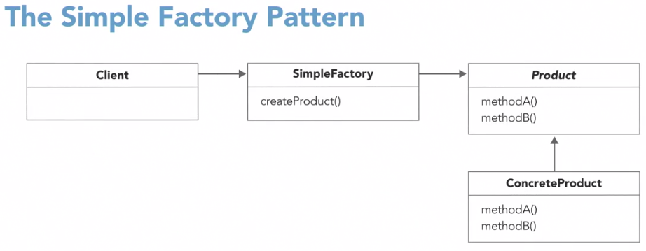
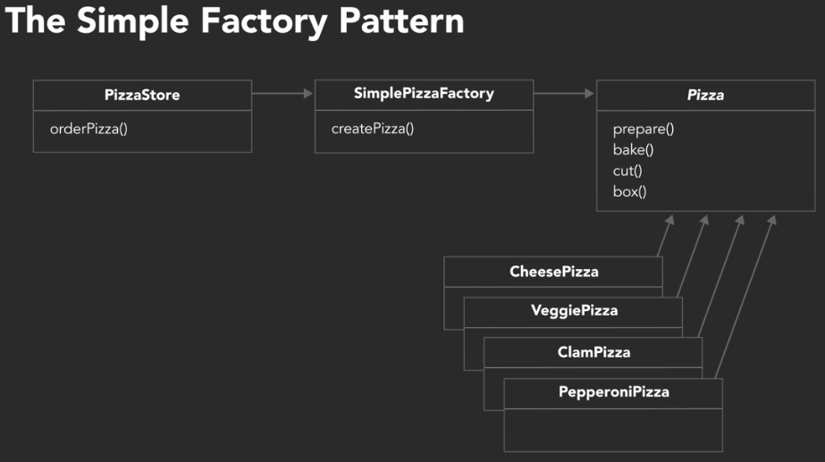

#
By Eric Freeman and Elisabeth Robson on LinkedIn Learning, authors of *Head First Design Patterns: A Brain-Friendly Guide to Design Patterns*

## Introduction
### Don't reinvent the wheel
designs should be
* flexible
* extensible
* more maintainable, resilient to change
* easier to communicate to your teammates


Central to these design patterns are a whole new set of design principles that go beyond the core object-oriented principles. These design principles will help you to avoid problematic designs and help you understand how design patterns work.

### What you should know
In this course:

Prerequisite: Knowledge with a OO language

UML to describe the pattern
Java to implement


## 1 Design Patterns
### OOD experience
The goal flexible, extensible

OOD basic principles:
* inheritance
* Polymorphism
* Abstraction
* Encapsulation

Design Pattern go to your brain first, then to your code.

Design Pattern started from Gang of Four, with 23 patterns 

Benefits:
* not reinvent wheel
* building resilient code
* prepareing for future addition

### What are design patterns
Design patterns are all about reusing experience, design experience. Not algorithms, not code.

A design pattern is usually
* expressed by a definition and a class diagram 
* collected into a catalog of patterns.
 

patterns are pretty abstract, it's up to you to determine
* if the pattern is right for your situation and your specific problem
* how best to implement it.


Design patterns are not specific solutions for specific kinds of software. 

Rather, design patterns are general solutions for common problems that crop up in all kinds of applications.

In this course, we'll be focusing on six of the 23 original patterns in the Gang of Four Catalog. These are the patterns you're likely to find most useful because they're approaches to the most common problems that crop up as you design and develop a software system. Once you've learned how to read and understand these six patterns, you'll be able to explore more patterns on your own.

You'll find a more complete treatment of the original 23 patterns in our book: *Head First Design Patterns: A Brain-Friendly Guide to Design Patterns*. We'll
* describe each pattern conceptually
* talk about its object oriented design in the form of a class diagram
* show code snippets to show you the key features of a pattern implemented in code.

### What are design principles


* inheritance
* polymorphism
* abstraction
* encapsulation
* single responsibility
* open-closed
* loose coupling
* composition over inheritance
* program to an interface, not an implementation
* encapsulate what varies
 
And these principles really give you a set of guidelines that will help you to avoid bad object-oriented design
* too rigid
* inflexible
* too fragile
* too hard to understand

Principles are general guidelines while patterns are specific design solutions often aimed at solving common object-oriented problems.


Principles tell us to strive for a particular quality in our design, and this is often where patterns come in. Design patterns often demonstrate different ways of fulfilling the principle. 

An important principle: **encapsulate what varies**: Identify the aspects of your application code that vary and separate them from what stays the same. 

> e.g. separating what varies in our design ->
the strategy pattern, which shows us how to separate out an object's behavior. It's algorithm, if you will, in a flexible and extensible way. This also won't be the last you see of the encapsulate what varies principle. This one principle forms the basis for almost every design pattern. Almost all patterns provide a way to let some part of the system vary independently from the other parts. And as you'll see, different patterns do this in different ways depending on the problems they're solving.


## 2 The Strategy Pattern
### Revisiting inheritance

Inheritance is one of the core concepts of object-oriented design. Through inheritance, you can express class relationships that allow you to reuse and extend the behavior and properties of other classes. Typically you think of one class inheriting from another if they share an **IS-A relationship**.

main benefit of inheritance: **code reuse**

#### Don't overuse
Inheritance is a powerful technique, and there are many designs where inheritance is exactly the right choice. <-> While inheritance is a core concept in object-oriented programming, it's also easy to overdo inheritance and make it the basis of all your object-oriented design.

**if all your class relationships are IS-A relationships, take a closer look at your design.**

**overuse inheritance**: inflexible and difficult to change

### Limitations of inheritance
#### Example: design classes for duck simulator

* Duck: abstract
    - quack()
    - swim()
    - display(): abstract
* MallardDuck
    - display(): implementation
* RedheadDuck
    - display: impl

This looks fine and works fine until it doesn't
* what if we need a rubberDuck class, it doesn't quack
    - implement a quack in RuberDuck and override the super class's quack
* new feature request for Ducks to fly.
    - add `fly()` to base class Duck
    - override it in RubberDuck since it doesn't fly
* new duck type: DecoyDuck requested
    - need to override `fly()` and `quack()` again.


The problem with this design: 
* need to override inheritance for some ducks for fly and quack
* duplicated code for overriding fly and quack
hard to gain knowledge of all ducks from the abstract class
* changes to base class requires changes to other ducks
* hard to change runtime behavior

### Trying interfaces
* an interface defines the methods an object must implement in order to be a particular type. 
* An interface is an abstract type that specifies a behavior that classes must implement
* interfaces allow different classes to share similarities
* not all classes need to have the same behavior
#### Rework the duck example with interfaces
Interface Flyable
* fly()
Interface Quackable
* quack()
Class Duck
* swim()
* display()

MallardDuck extends Duck implements Flyable, Quackable

Problem with this approach:
* destroys code reuse, each duck will need to implement it's only fly and quack. 
* change to fly or quack would cause maintenance nightmare
* still not ally runtime change to behavior
    - how to simulate a duck to acquire ability to fly, or lose it during runtime.

### Get inspiration from design principles
#### 1. A review of our attempts

* inheritnace didn't work well
    - Behavior changes across subclasses and it's not appropriate for all subclasses to have all behaviors
* interfaces didn't work well
    - interfaces supply no implementation and destroy code reuse.

#### 2. revisit design principles

Encapsulate what varies: Identify the aspects of your application that vary and separate them from what stays the same.
* if some aspect of your code is changing that's a sign you should pull it out and separate it.
* by separating these parts, you can extend or alter them without affecting the rest
* this principle of what varies is fundamental

#### 3. go back to our design
* swim doesn't vary across classes
* fly and quack is changing for different ducks, so we need to extract it from the rest of the code.
* display is implemented in each duck


#### 4. another design principle: Program to an Interface
**Program to an Interface**, Not an implementation: clients remain unaware of the specific types of ojects they use, as long as the objects adhere to the interface that clients expect.

### Programing to an interface
new implementation after reviewing two principles

Interface FlyBehavior
* fly()
    - Class FlyWithWings
    - Class FlyNoWay

Interface QuackBehavior
* Quack()
    - Class Quack
    - Class Squeak
    - Class Mute

Class Duck
* FlyBehavior flyBehavior
* QuackBehavior quackBehavior
* setFlyBehavior()
* setQuackBehavior()
* performQuack()
* performFly()
* swim()
* display()

Now each duck class only need to implement the `display()` method.
#### My Note
* Having behaviors as a member not a interface, transforms **Is-A** relationship to **Has-A** relationship. 
* somewhat composition over inheritance

### Applying the principles
A java implementation of this design. See excercise file. 

Transcript: Let's take a look at some sample code to demonstrate how we implement our new design and pull out and separate what varies in our code. For this sample code, we'll just Java. We'll be showing just a few snippets of code. To see the full working examples, download the exercise files.

We'll begin by looking at the flying and quacking behaviors we've pulled out from the ducks. Recall one of the design principles we've talked about. **Program to an interface, not an implementation**. For both our behaviors, we'll define interfaces that all behaviors will implement.
* So, all fly behaviors will implement the flyBehavior interface. For example, we might implement a FlyWithWings behavior that implements regular flying and a FlyNoWay behavior that implements no flying for a duck that can't fly.
* Likewise all quack behaviors will implement the quack behavior interface.
    - We might implement quacking behaviors like regular quaking for a real duck and squeaking for the rubber duck.
    - Another quacking behavior we might implement is silence for ducks that don't quack at all like the decoy duck.
   
One thing to notice about these behaviors is that they're completely separate from our ducks. We could use these behaviors with any code that needs duck behaviors.

Now let's take a look at the code for the ducks. We'll begin with the Duck superclass. This is the superclass of all ducks in the system.
* It's an **abstract class** with an abstract method `display` meaning we must subclass this class with concrete ducks like mallard ducks and rubber ducks and those classes must implement the `display` method.
* Notice that the swim method works for all the concrete ducks, so we didn't need to pull that method out into separate behavior.
* We've got two variables in the Duck class, `flyBehavior` and `quackBehavior`. We'll use these variables to **compose** a duck with its flying and quacking behavior.
    - Notice that we're using the interface types for these variables, so we can store any flying and quacking behavior in these variables.
    - Now when we want a duck to fly, we'll call performFly. This method then delegates to the composed flyBehavior.
    - And we do the same for quack. To get a duck to quack, we call performQuack which delegates to the composed quackBehavior. 
   
Now let's take a look at a concrete duck to see how we compose behaviors with ducks.
* Here we've got a `MallardDuck`. It extends Duck so it inherits the two properties, `flyBehavior` and `quackBehavior` as well as the `performFly` and `performQuack` methods. We're initiating the MallardDuck with the `quackBehavior` and the `FlyWithWings` behavior. We do this in the constructor so a MallardDuck is initialized when we first create it. We could instead pass in the behaviors we'd like but for this example, we're just setting the default behaviors in the constructor.

Finally, we bring everything together in the MiniDuckSimulator which is where we create ducks and test their behaviors. Here we're creating a MallardDuck and then asking it to quack and fly.
* To get the duck to quack, we call performQuack. And recall that performQuack delegates to the quackBehavior quack method that's composed with the duck. For MallardDuck that's a regular quack behavior. So, we should see quack in the simulator.
* And to get the ducks to fly, we call `performFly`. `performFly` delegates to the `flyBehavior` fly method that's composed with the duck and for `MallardDuck`, that's the `FlyWithWings` behavior so we should see I'm flying in the simulator.

Here again is our design for the ducks showing the fly behaviors and of course we have an analogous set of quack behaviors too. **Rather than having our ducks rely on specific implementations of quack and fly, we're now relying on interfaces within the ducks to give us the flexibility we need.** Each duck will have a flyBehavior and a quackBehavior and we won't know precisely which ones until that's set at runtime. And because we're using interfaces to specify those behaviors, we'll have the flexibility to change them as we need to and the ducks no longer need to know any details of how specific behaviors are implemented. With all that design out of the way, let's now see how this works in some sample code.

The design diagram:


### Exploring the strategy pattern
Pulling out fly and quack behaviors from inheritance, and instead compose these behaviors with duck. 
* more flexible 
* more resillient to change. 

The class diagram of strategy pattern:


We have an inheritance hierarchy that defines the type of the objects that need a behavior and we have a HAS-A relationship between those objects and their behaviors. These behaviors can be anything. Any algorithm that an object might need to perform. 
By moving these algorithms out from the main inheritance hierarchy, we get the benefit of being able to choose which algorithm each object gets. We can change these algorithms at runtime and if multiple objects need to use the same algorithm, we get the benefit of code reuse too

#### The official definition of **the strategy pattern**:
The strategy pattern defines a family of algorithms, encapsulates each one and makes them interchangeable. Strategy lets the algorithm vary independently from clients that use it.

**a family of algorithms** can be considered a **strategy**.

#### My note
encapsulation promotes separation and reuse. The more granular a design gets, the more reuse opportunities there are.

### Why HAS-A is better than IS-A
IS-A: inheritance
HAS-A: composition


(Benefit of composition over inheritance)When you put two classes together, with composition, instead of inheriting behavior, an object can then instead delegate that behavior, to the composed object.

#### Principle
**Favor composition over inheritance**: classes should achieve code reuse using composition rather than inheritance from a superclass.

Composition generally leads to a more flexible design, and is often used as a design technique in a lot of design patterns.

Another benefit: Composition allows runtime dynamic assignment, while inheritance is compile time assignment. Rather than limiting us to one specific implementation of behavior, we can make use of any appropriate concrete behavior, that's been implemented as a fly behavior. In fact, we can say that **composition gives us a whole new family of algorithms, that we can make use of**

#### My note
Benefits of Composition over inheritance:
* behavior is delegated to a composed object, provides more flexibility, reusability and extensibility
* Composition allows dynamic behavior assignment during runtime, while inheritance is design/compile time assignment. 


### Challenge: The Strategy pattern
Transcript - Take a look at the class diagram on this slide. We have an abstract class, PhoneCameraApp, with four methods: take, edit, save and share. And, we have two concrete classes that extend PhoneCameraApp. BasicCameraApp, and CameraPlusApp. The edit method in the superclass is abstract, because each camera app will provide its own specialized editor, but the rest of the methods can be inherited by the subclasses. We get a lot of code reuse, because the taking, saving and sharing are the same across many apps. That way, the apps can implement custom editors that get the other functionality for free from the superclass. The share method in the superclass lets the user pick how they want to share the photo, and then uses that algorithm to share. Right now, the share method allows the user to share photos by text and by email. We're running into a problem, however. We keep having to open up the PhoneCameraApp class to modify the share method every time a new way to share photos crops up. You've been tasked to add another way of sharing photos to social media, but you're worried that every time you open the superclass to edit the share method code, you risk creating bugs in the system. You'd love to separate that sharing code from the rest of the PhoneCameraApp superclass so you don't risk causing a problem each time you have to edit the class. Your challenge is to redesign this class design to use the Strategy pattern, to encapsulate what's varying, that is, the sharing algorithm, and make it easy to modify the code and add new sharing algorithms without having to open up the superclass to do so. And, while you're at it, go ahead and add the social media sharing to the class design, too.

### Solution: The Strategy pattern
Here's our solution to the challenge. We've pulled out the different ways of sharing into a separate family of classes that implement sharing by texting, sharing by email, and sharing on social media. This is our family of algorithms. We've also added a property to the PhoneCameraApp superclass that will be composed with a strategy that the user selects. Now when the share method is called, the super class is going to delegate sharing to the user's preferred share strategy. So this design allows us to more easily add, change, and remove sharing strategies without have to modify any code in the camera app or any code in the concrete camera app classes.

### My summary
Strategy pattern key bullets
* Has-A instead of Is-A, composition over inheritance
#### Principles
* encapsulate what varies, so it can be reused
* program to interface
* composition over inheritance

## 3 The adapter pattern
### Understanding the adapter pattern
Example, to use a US plug in EU, an adapter makes it usable. The adapter doesn't change the plug itself, but adapts it's interface. Like a transform. 

#### My note
Think of a wrapper, that's doesn't change the existing code, but let's existing code talk to new/different interface.

Or a mapper, mapping existing interfaces with new interface.

This is not just a software pattern, but a generic mental model in life. Think of adapters, wrappers, mappers, transforms, translation.

The difference from a mediator is adapter is meant more for a 1 to 1 interaction with translation. *Mediator, is more of gathering things from multiple sources to one place, and distributing them.*(My understanding as of 2021, may not be right)

### The Adapter pattern defined
The Adapter Pattern is used to convert the interface of a class into another interface that clients expect. Adapter lets classes work together that couldn't otherwise because of incompatible interfaces.

Two classes work together when they have incompatible interfaces. A class diagram:


> First, we have a client that is expecting to make a call on a target interface. In our example, the target interface would be the old vendor's interface. 

> Next, we have an Adapter class that implements that target interface. This class is composed with an Adaptee class which the Adapter is going to make calls on. In our example, the Adaptee would be the new vendor class. So, when the client makes a call on the Adapter, using the target interface, the Adapter converts that call into one or more calls on the Adaptee.

> So, how does this work. Let's step through how this works at runtime.
* First, our client makes a request to the Adapter. In this case, by calling the request method which is part of the target interface.
* Next, the Adapter translates that call to the equivalent call on the Adaptee. This may take one or more calls to the Adaptee depending on the granularity of each interface. We'll see an example of this in a moment.
* After the Adaptee call is complete, the Adapter then returns the result, if any, to the client. 
* The client receives the results of the call and never knows an Adapter's translating the calls to calls on the Adaptee's interface at its request.

### Using the Adapter pattern
Transcript


Let's implement an example of the adapter pattern in code. We'll begin with a client which is a duck simulator class, a duck interface with just two methods, quack and fly, and a mallard duck that implements the duck interface. If we test the mallard duck in the simulator, that's easy. We can just pass the duck to the test duck method and the simulator implements the duck interface so the simulator already knows how to make a duck quack and fly by calling the quack and fly methods.

Now what if we have a turkey and we want to use the **turkey** in the duck simulator? The turkey class has a slightly different interface from a duck, so we can't just plug a turkey into the duck simulator. We can't use turkeys in the duck simulator because the duck simulator test method is expecting objects that have the duck interface with the quack and fly methods. **Turkeys use a different interface with the method gobble that's used to make sound instead of quack.** So we can't just pass a turkey to the test method or call quack on a turkey. That won't work. So what do we do? Well we create an adapter. 

We'll do that by making an adapter class that converts the turkey interface to the duck interface. As you can see here, the duck simulator is the client, the duck is the target interface, the turkey adapter is the adapter, and the turkey is the adaptee.

* The **turkey adapter implements the duck interface** so that the duck simulator will know how to make the turkey quack and fly.
* And the **turkey adapter is composed with the turkey** so it can convert calls to quack and fly into gobble and fly.

Here's the turkey adapter in code. The turkey adapter class implements the duck interface. So this class must implement the two methods in this interface, quack and fly. The adapter is composed with the adaptee, that is, the turkey, and we pass the turkey into the constructor and save it there. The quack method delegates to the turkey's gobble method and likewise, the fly method delegates to the turkey's fly method. Only because turkeys don't fly as well as ducks, we're going to call the turkey's fly method five times, so it flies a bit longer. So that's how the turkey adapter adapts a turkey to the duck interface. 

This adapter is pretty simple. We didn't have to make too many changes to make the turkeys fit into the duck simulator, although we did modify fly just a little bit.
* Some adapters may require multiple calls to convert from one interface to another correctly.
* And some adapters may return values from the adaptee to the client.

Now let's bring it all together by taking another look at the client, the duck simulator. In this version, we've added code to make a wild turkey, but we can't pass a wild turkey to test duck because the test duck method expects a duck. And the wild turkey has the wrong interface. So we create a turkey adapter and pass in the wild turkey to the adapter. Notice that because the turkey adapter implements the duck interface, we can treat the turkey adapter as a duck. Then we can pass the turkey adapter to test duck to test the turkey in the simulator.

As we did in the strategy pattern, we're once again using **composition** to get flexibility in our design.
* We have a client that's expecting to make calls on a class with a given interface. So we **compose that client with an adapter**(DuckSimulator) and we **compose the adapter with the adaptee**(turKeyAdapter). The adaptor sits in the middle of the client and the adaptee and delegates the client's calls to the adaptee.

The advantage of the adapter pattern is that you can add an adapter easily
* without having to modify the adaptee at all
* and only modify the client to add the adapter

Say you have a vendor class that you can't modify and it uses a different interface than you expect, but you really need to make the vendor class work with your system. Well, the adapter pattern makes this easy.

#### My note
The adapter class implements the interface that the client expects, and composes with the adaptee(adaptee is a member of adapter in runtime). Then a call from client to adapter will get translated/delegated to methods on the adaptee.

### Challenge: The Adapter pattern


You've just learned how you can use the Adaptor pattern to create an adapter that adapts turkeys to ducks. In this challenge, you are going to create an adapter to adapt a drone to a duck. A drone is a small robot that can fly and is used to take photographs and videos from above. It makes a beeping sound, and it can fly by spinning its rotors and taking off. But the drone's interface is a bit different from the duck interface. So your challenge is to create an adapter for the drone so we can use the drone in the duck simulator. Here's the drone class. Can you create an adaptor class that allows it to run in the simulator?

### Solution: The Adapter pattern
Here's our solution for the drone adapter. Remember that the adapter needs to implement the interface of the object it's adapting to. Which in this case, is the duck. So the adapter must implement the two duck interface methods quack and fly. The drone adapter takes a drone. The quack method of the drone adapter delegates to the beep method of the drone. So the drone makes a sound. The fly method of the drone adapter is a little more complex. To fly the drone, we actually need to call two methods: spin rotors and take off. So one method in the duck interface corresponds to two method calls in the drone's interface. Now that we have the drone adapter that implements the duck interface, we can add the drone to the duck simulator. 

Here's how we do that. We first create a drone and then create a drone adapter, passing the drone to the adapter. What we get back is a drone adapter, but remember, it's also a duck, since the adapter implements the duck interface. So we can treat the adapter as a duck. Now we can pass the drone adapter to the test duck method and it'll work fine.


## 4 The Observer pattern
### Understanding the Observer pattern
The observer pattern exemplifies the design principle of **loose coupling**. 

#### Loose coupling
Strive for loosely coupled designs between objects that interact.

What are loosely coupled objects? We say that objects are loosely coupled when they interact with one another, which makes them coupled, but they don't know a lot about each other, which makes them loosely coupled.

With loose coupling, objects don't become too dependent on each other. As we'll see, this helps to keep our design more flexible. 

For instance, with the observer pattern, loose coupling helps us to minimize the complexity of a scenario where there are a lot of objects coming and going during a computation, and those objects need to be kept up to date on an important piece of data or a set of events. 

The observer pattern is one of the most commonly used patterns. You'll use it in your own code, and you'll see it used in many libraries and frameworks. 

A real world analogy: your standard newspaper or magazine subscription
* A publisher creates a newspaper, and starts publishing it.
* You subscribe to the newspaper, and, as long as you stay subscribed, you get each issue.
* You can unsubscribe at any time, and you'll stop receiving issues.
* Other readers can subscribe, too, and you'll all receive issues, as long as they're published, and as long as you remain subscribers.

Formal example: 
* a publisher object
* Any object can send a **request to subscribe** to the publisher object. When the request is received by the publisher, the requesting object immediately becomes a subscriber
* Any object can ask to be a subscriber, meaning: **we don't really care what kind of object makes the request**. Obviously, there'll be objects that aren't subscribers.
* any subscriber, can unsubscribe at any time by making a request to the publisher.
* The publisher typically **holds some data of interest**. That could be a stock quote, or weather temperature, or an entire data structure, any type of data that could be interesting. 
* When the data changes, all the subscribers are notified.

#### My note
Observer pattern, Sub-Pub

### The Observer pattern defined
**The definition** The observer pattern defines a one-to-many dependency between objects so that when one object changes state, all its dependents are notified and updated automatically.

**To better understand**:
* First, a **one-to-many relationship** between a set of objects.
    - We often call these objects the **subject** and the **dependent**, which is analogous to **publisher** and **subscriber** in our example 
* we call it a one-to-many because if the state changes in the subject, then the many dependents are notified of that state change. 
* All **dependent** means here is that these objects are dependent on the subject for data. dependent = subscriber = observer.
* The subject owns the data in the sense that there's only one copy of it
    - benefit of making the subject the sole owner: we end up with a design that's cleaner than many objects owning the same data
* And finally, the observers, because they are observing, will get notified anytime the subject's state changes.


There's a few different ways to approach the class design for the observer pattern so let's look at a common one. 


In this class diagram, 
* we have a **subjects interface** which includes two methods(`registerObserver()` `removeObserver()`) that allow observers to register and to remove themselves as subscribers. It also includes a `notifyObservers` method which is responsible for notifying each observer of data changes.
* **Concrete subjects** must implement these methods.
* We also have an **observer interface** that has an `update` method which all concrete observers need to implement.
* **A concrete observer** can be **any class** that wants to implement the observer interface. The update method will be called by the subject when the subject's data changes. 
* Now depending on your implementation, when update is called, the observers may be sent a new value as part of the update call or the observers might have to explicitly ask the subject for the new value. 

### Using the Observer pattern
Let's take a look at the Java code to implement our basic observer pattern design. 

We'll start with the `Subject` interface. This specifies the three methods the concrete subject must implement
* `registerObserver`, to allow observers to register themselves
* `removeObserver`, to allow observers to stop participating
* `notifyObservers`, which will make sure all the observers are notified if the data in the subject changes. 

```
public interface Subject {
    public void registerObserver(Observer o);
    public void removeObserver(Observer o);
    public void notifyObserver();
}
```

The concrete subject, named `SimpleSubject` here
* implements that interface, and so must implement those three methods
* The `SimpleSubject` manages the list of observers, in this case, using an `ArrayList`.
* And, it manages the data that the observers are interested in. Here, that's just an integer, value. 
* Observers
    - call `registerObserver` to add themselves to the list of observers in the subject
    - call `removeObserver` to remove themselves from the list.
    - Let's say the value in the subject changes. Perhaps, another object calls setValue to change the value. Now, the subject must notify all the observers that are participating. This is where the `notifyObservers` method is used. In that method, we iterate through all the observers in the list, and call update on each one, passing it the new value.
```
public class SimpleSubject implements Subject {
    private ArrayList<Observer> observers;
    private int value = 0;
    public SimpleSubject() {
        observers = new ArrayList<Observer>();
    }
    public void registerObserver(Observer o) {
        //add observer to list
    }
    public void removeObserver(Observer o) {
        //remove observer to list
    }
    public void notifyObserver() {
        for (Observer observer: observers) {
            observer.update(value);
        }
    }
    public void setValue(int value) {
        this.value = value;
        notifyObservers();
    }
}
```

All observers that want to participate, that is, get notified when the subject's data changes, must implement the `Observer` interface. This has one method, `update`. Observers can be any type. As long as they implement the Observer interface, they can participate in the pattern.


```
public interface Observer {
    public void update(int value);
}
```

A concrete observer, the `SimpleObserver`, implements that `Observer` interface. The observer needs a reference to the subject so it can add itself to the list of observers, by calling . In this example, we pass the subject to the observer in the constructor, and register the observer right away. And, of course, the observer must implement that update method. This is the method that the subject will call when its data changes. The subject passes the newly updated value to the observer which saves the value and displays it.

```
public class SimpleObserver implements Observer {
    private int value;
    private Subject simpleSubject;

    public simpleObserver(Subject simpleSubject) {
        this.simpleSubject = simpleSubject;
        simpleSubject.registerObserver(this);
    }

    public void update(int value) {
        this.value = value;
        //DO something
    }
}
```


### The Observer pattern and loose coupling
Subjects and observers are loosely coupled. How the observable pattern helps make our design loosely coupled
* they interact, which makes them coupled
* they really don't know a lot about each other, which makes them loosely coupled. 
* The subject knows only that the observer implements a certain interface. It doesn't need to know the concrete class of the observer.
* The subject only need to know about the list of observers
* any class can implement the observable interface and effectively subscribe to the subject.
* The observers can add, remove, or be replaced by another observer at any time.
* The subject just doesn't care. All it does is maintain a list and notify the objects on that list as necessary.
* If we ever want to add a new type of observer, we can do that without ever touching the code of the subject. 

Any changes we make to the **subject** or the **observers** never affect the other. That's true **loose coupling**.

### Challenge: The Observer pattern - (Transcript)
The observer pattern can be used to loosely couple objects together. Whenever you have objects that want to be notified when another object is updated. In this challenge, you'll design a weather station and various classes that are interested in the weather station's data. Including a user interface, a logger, and an alert system. The weather station has a set of sensors that are used to measure temperature, wind speed, and pressure. The user interface, logger, and alert system are all interested in the data, and want to be notified when the weather station gets new data from the sensors. Make sure your design allows for other observers to easily be added to the design. For instance, you might want your business to get notified by the weather station too, and you don't want to have to change the code in the weather station.

### Solution: The Observer pattern - (Transcript)
Here's our solution to the challenge. We created a new subject interface that the weather station implements, and we added a list of observers to the weather station. We created implementations of the methods required by the subject interface to allow observers to come and go and to notify observers when the weather station's data changes. We also added a new observer interface with an update method and had each of the classes interested in the weather data implement that interface. That means each class needs to implement the update method. In addition, each class gets a reference to the weather station to access the methods in the weather station to add and remove themselves whenever they want from the list of observers.


### My summary

* `Subject` interface
    - `Observer observers`: list of references to observers
    - `registerObserver()`
    - `removeObserver()`
    - `notifyObserver()`: calls update on all observers
* `Observer` interface
    - `update()`

Loose coupling: 
### quiz

Loosely coupled means routines are called by an application and executed as needed.

Publishers post messages to a message broker, and subscribers register subscriptions to the message broker.


## 5 The decorator pattern
### 5.1 Creating chaos with inheritance
A real world example:
> Let's say you want to build an order system for a small coffee shop, one which serves and takes payments for beverages. The shop has four main types of beverages on the menu, each of which has a description and a cost. And to each beverage you can add a number of condiments like soy or milk or whip or mocha. Each of these condiments has a small cost which needs to be added to the cost of the coffee. 

Design I


Let's sketch out a design for the coffee shop's order system. We'll start with a beverage superclass which has a description field and a corresponding getter method as well as a cost method. Now let's add some subclasses like house blend, dark roast, decaf, and espresso. Note that each coffee is a beverage. In other words, we have an is-a relationship between the coffees and the beverage superclass. Also in each subclass we're overriding the cost method to calculate the cost of each particular coffee.

So far this looks like a nice, simple design that we can extend to other drinks in the future.

But we're forgetting that there are many variants of these beverages.
* Customers might want to add condiments to their order, say a decaf with soy or a dark roast with whip and mocha. One way we could take care of those variants is by adding some **concrete subclasses** like
    * a house blend with steamed milk
    * house blend with mocha or house blend with whip and soy
    * and so on
* we'll need variants for a dark roast and decaf and espresso as well. You probably get the picture. This is going to be a lot of classes and we haven't even scratched the surface of all the possible combinations we can have.
* And what happens when we add new drinks or condiments
* what if we encounter some change like when the cost of a condiment increases? That's a lot of changes to our code. 

Design II


Let's take a different approach. What we've done in this design is to add some properties in the superclass to track the condiment in the order. So here for each condiment we have a boolean field and a corresponding method to track if that condiment is being used in the coffee.

Now let's subclass the beverage superclass again for each type of beverage. 

Let's see how this is going to work for an example order like a house blend with soy and whip. We first create the house blend beverage. Then to add soy and whip we can call the set soy and set whip methods respectively. After that, we can compute its cost. All this depends on the cost method in each beverage subclass, which is going to get rather complicated because we always have to test every possible condiment. But this might work so let's analyze it. 

Well, it looks much simpler but 
* we have to consider that the **price changes** will potentially affect every single class.
* And if we **add a new condiment** we have to open up the code in the superclass and change it.
* Some condiments aren't appropriate for beverages and so we'll have to add complex logic in the cost method to enforce that.
* And we can't even handle orders like double mocha without adding some more logic in the cost method.

We've got a design but it doesn't feel very flexible or maintainable at this point.

#### let's try decorator
The decorator pattern can help. Using the decorator pattern to solve this problem will give us a lot of flexibility in the design. We'll be able to add new drinks and condiments without having to change a lot of code. And remember how we talked about favoring composition over inheritance? The decorator pattern shows us how we can use composition to get the flexibility we want without all the complexity. We've tried two approaches to our design and neither worked very well. So let's give the decorator pattern a try. Before we dive into the pattern though we'll need to take a look at one more principle that can help us

### Understanding the open-closed principle
the open-closed principle: classes should be open for extension but closed for modification.

What does that mean? Well, think about our current design for the coffee shop. We know in the future we'll need to support new beverage types and new condiments but that means we'll have to modify existing code, and that's exactly what we don't want. 
* We want to leave our design open for new beverage types and condiments
* closed in the sense that we don't want to touch existing code. 

**Open-closed** means we have **flexibility** and **maintainability** because we can add new behavior but without the risk of introducing new bugs into the code we've already written.

**Our goal** is to have designs that we can augment at any time but do it without touching existing code. 

This sounds like a great quality for our designs to have but it begs the question

#### How do we design object systems that adhere "to the open-closed principle?
How do we allow something to be extended "that can't be modified?" **Composition over inheritance** can help.


* Inheritance
    * Powerful, but can leads to inflexible, fragile designs that can't adapt to change
    * When we subclass, we make **static compile time decisions** that we're stuck with, and **all classes have to inherit the same behavior**.

* Composition
    * When we use composition we can still take on new behavior but we do it by composing objects together.
    * We can make runtime decisions
    * add behavior without altering existing code.
    * We can even add new behavior the creator of the classes never even thought of

The end result often proves to have far fewer bugs and side effects, and overall we get more flexible designs. 

Decorator is also about composition over inheritance.


### Extending behavior with composition

#### Transcript
Before we jump into a formal definition of the Decorator pattern, let's first get a conceptual feel for how Decorator works and in particular see how we might use composition to solve our problems. 

To do that, let's go back to our original beverage design. Now, let's say a customer wants to order *DarkRoast with Mocha and Whip*.
* So, let's start simply by instantiating a DarkRoast object, shown here. Let's also call this object our *base object*, the coffee itself.
* Next, the customer wants Mocha, so let's create *a second object, a Mocha object and wrap it around or compose it with the DarkRoast object*. We'll call Mocha a **Decorator** and as to the hint to the structure of all this, *Mocha's type is going to **mirror** the type of the object that it's composed with.* Which, in this case, is a beverage. So, Mocha also has type beverage. Note that means it also has a cost method, so keep that in mind.
* Now the customer also wants Whip, so let's create a Whip object and wrap it around or compose it with the Mocha object. Like Mocha, *Whip also **mirrors** the type of the object it decorates*, which is of type beverage. So remember, that also means Whip is going to have a cost method.
* So, now we have an interesting set of objects composed together. Reading the object names from the inside out they also happen to match our drink order. DarkRoast, with Mocha and Whip.
* And as you can see, each of these objects has a cost method and is also responsible for their part of the cost. The DarkRoast knows it costs $0.99. The Mocha knows it costs $0.20. And the Whip knows a cost $0.10. So, let's see how this works. We can call cost on the outermost object Whip and then it's going to delegate that cost to the next object, which is Mocha. Which then delegates that cost to the next object which is the DarkRoast, our base coffee. But the base class is a little different. All it does is return its cost. Each time we delegate, we get a value back and then we add that cost to our own and finally return the cost. back to the caller.

Now it's time to look at how this is actually achieved in classes and code. But before we do, note how flexible this design is. We can add as many condiments as we want. How about espresso with Mocha, Steamed Milk and triple Whip? How about _espresso with Mocha, Steamed Milk and triple Whip_?

### Understanding the decorator pattern
The decorator pattern attaches additional responsibilities to an object dynamically. Decorators provide a flexible alternative to subclassing for extending functionality

and we have a sense of how this design pattern can help us make a flexible design from our coffee example. As you're seeing, the formal definition of a pattern usually describes the role of the pattern, but it doesn't necessarily help us know how to implement it in our own designs.

As with all design pattern definitions, we really need to look at a *class diagram* to get a better sense for how the pattern works. 
#### Class diagram
Two important parts to the decorator pattern
* The **components** which are the beverages in our example
* The **decorators** which are the condiments in our example


* Starting at the top of this diagram, you can see that we have a **component class** - an **interface, or abstract class**, that's implemented by the concrete components.
    - So in our example, the component class will be the beverage, and the concrete components will be the different types of coffees
* The **decorators** also implement the **component**, and that's an important piece of the decorator pattern. We have a **decorator** class which is often **an abstract class**
* then we have the concrete **decorators** that implement it
    - e.g. the milk, the soy, and whip condiments in our example. 

The reason it's so important for both the concrete components and the decorators to implement the component's superclass is because we want to make sure that we can treat each class in the same way. That is, **we want to be able to wrap any decorator around any of the components**.

> For instance, in the coffee shop example, we want to be able to wrap any of the condiments around any of the coffees and then call the cost and get description methods on any of these wrapped objects. We should also be able to call cost on an unwrapped object and get the correct result. This will become a lot more clear when we look at some code, and we'll do that next.

### Using the Decorator pattern


* our new design uses a common super class beverage for both the coffees and the decorators.
* each decorator is composed with the beverage it is wrapping

#### component super class
```
public abstractclass Beverage {
    String description = "Unknown beverage";
    public getDescription() {
        return description;
    }
    public abstract double cost();
}
```
The beverage class - our component super class.
* It implements a get description method that returns the string unknown beverage. But hopefully the concrete component classes will override this to a better description.
* And it specifies an abstract method cost that subclasses must implement.

#### Concrete Components
```
public class DarkRoast extends Beverage {
    public DarkRoast() {
        description = "Dark Roast Coffee"
    }
    public double cost() {
        return .99;
    }
}
```


Now let's take a look at one of the concrete components. These are the coffees that extend the beverage class. For instance, the dark roast class extends beverage and sets the description string it inherits from beverage to dark roast coffee, so we get a good description of the coffee. Then, dark roast implements the cost method and simply returns 99 cents, which is the cost of a basic dark roast coffee with no added condiments. 

That takes care of the coffees, so now let's take a look at the decorators. 
#### Abstract Decorator
```
public class CondimentDecorator extends Beverage {
    public abstract String getDescription();

    // no need for overriding cost() since subClass will need to implement this
}
```
Condiment decorator class. This class extends the beverage class, meaning it inherits the get description method. But we're going to override the get description method with an abstract method, so we force all concrete decorators to implement that method. Because condiment decorator is abstract, it does not need to implement cost. But any concrete decorators will need to do that because cost is abstract in beverage.

Now let's implement some decorators. 

#### Concrete Decorators
Each condiment that can be added to a coffee is implemented as a decorator class. Here's an example of a condiment, the whip condiment.


```
public class Whip extends COndimentDecorator {
    Beverage beverage;
    public Whip(Beverage beverage) {
        this.beverage = beverage;
    }

    public String getDescription() {
        return beverage.getDescription() + ", Whip";
    }

    public double cost() {
        return beverage.cost() + .10;
    }
}

```
It extends condiment decorator, so it must implement the get description method and the cost method. 
* Each decorator is composed with the beverage that it's wrapping. And the type of the `beverage` is `Beverage`, meaning the super class of both the concrete beverages, that is the coffees, as well as the decorators. That means that we can wrap a condiment around either a basic coffee or a decorated coffee. 
* We pass the beverage that we want the condiment to wrap into the constructor class, and store it.
* Then in get description, we first get the description of the beverage we're wrapping, and then add whip to that. So if we're wrapping a dark roast, we'll get the string dark roast coffee from the beverage and add on, comma whip.
* Finally, to get the cost, we first get the cost of the beverage we're wrapping, and then add 10 cents to that. Again, if we're wrapping a dark roast coffee, we'll get 99 cents and we'll add 10 cents and return the total cost of $1.09 for a dark roast with whip. 

Let's look at an example of how to put everything together.
#### Put everything together

```
public class Starbuzz {
    public static void main(String args[]) {
        Beverage beverage = new DarkRoast();
        beverage = new Mocha(beverage);
        beverage = new Mocha(beverage);
        beverage = new Whip(beverage);
        System.out.println(beverage.getDescription() + "$" + beverage.cost());
    }
}

```

In the main Starbuzz Coffee class, we've received an order of a double mocha dark roast with whip. 
* We first create the dark roast coffee. We store that beverage in a variable of type beverage.
* Next, we pass that beverage to the mocha constructor to create a mocha decorator. **It's important to notice here that we also store this in the variable of type beverage.** That's so we can continue to decorate the beverage. Remember, that decorators are composed with beverages.
* Next, we do that again to get a double mocha decorator with a dark roast.
* Finally, we pass that beverage to the whip constructor. And we get back whip decorated beverage. 

At this point, we have a dark roast coffee, decorated by two mochas and a whip. Now it's time to compute the final description and cost. We call get description on the outermost decorator, the whip decorator. Remember that whip delegates to the beverage it's wrapping to get the description, and then adds on comma whip. And the mochas do the same. And finally, the inner mocha delegates to the dark roast and gets back a string, dark roast coffee. This is where the delegation stops, so the resulting string propagates back out and we get dark roast coffee, comma mocha, comma mocha, comma whip. The same thing happens when we compute the cost. Each decorator delegates to the beverage it's wrapping to get the cost. And then adds on the cost of the decorator, so the result we get back is the total cost of the beverage.


By using composition, we get flexibility in how we add condiments or capabilities to our beverages. And by using a common beverage super type with inheritance we get the type structure we need to treat coffees and decorated coffees both as beverages. So we can decorate beverages multiple times and call get description and cost on basic coffees or decorated coffees.


### Challenge: The Decorator pattern - Transcript
Let's say you want to start up a pizza store, offering both thick and thin crust pizzas. You'd like to offer a variety of toppings for the pizza that can be combined in any way the customer wants, and you'd like to be able to easily add and remove toppings from the menu over time as you determine what your customers like. You'll need to be able to get a description of the pizza to hand to the chef and a total cost of the pizza to charge the customer for their order. Your challenge is to design a system for the pizza store using the Decorator pattern. Have fun, and feel free to get a snack while you're working on the challenge just in case you're hungry.
### Solution: The Decorator pattern - Transcript
Here's our solution for creating pizzas with the decorator pattern. In this solution, we've closely followed the decorator pattern structure. First, we define a Pizza class that has a getDescription method and an abstract cost method. Then we added ThinCrustPizza and ThickCrustPizza concrete subclasses, which both extend the Pizza class. We also created a ToppingDecorator class that, again, following the structure of the decorator pattern, extends the Pizza abstract class. Note that ToppingDecorator has a property Pizza and an abstract method getDescription. Extending the ToppingDecorator, we've created classes Cheese, Olives, and Peppers for our toppings. We'll pass in the pizza the toppings are decorating and the constructor, and store the pizza in the Pizza variable that's inherited from the ToppingDecorator class. The cost method in the pizza classes return the cost of the basic thin or thick crust pizza, while the cost method in the toppings classes returns the cost of the pizza plus the topping. This works just like in our coffee example. 

Remember that with decorator, we use inheritance to get a common supertype for pizzas and decorated pizzas and we use composition to add topping decorators to our pizza.


## 6 Iterator Pattern
### Encapsulating iteration

We have many ways to store collections of objects in data structures, like Array. Most languages provide additional structures for storing collections of objects like lists, dictionaries and sets, like an ArrayList.

Simple enough, but what if we need to write code that operates over several of these collection types?

The scenario: we write code to iterate through an array, then we changed the data structure to an ArrayList, we need to rewrite the whole thing.

Is there a way that we can avoid rewriting the iteration code if we change our collection type? Let's use the same tactic we've been using and **separate out what varies and encapsulate it**. What's varying here? Our iteration. But how do we encapsulate iteration? That's what the iteration pattern helps us do.
### Understanding the Iterator pattern
#### Transcript Understanding the Iterator pattern
As we've seen, we've got two menus with two different implementations. One uses an Array, and the other uses an ArrayList. That means that the class responsible for printing the menus, the cafe, needs to use two different methods of entering through the menu items. So the two menus are exposing the details of how they're implemented to the cafe, which means that the cafe is dependent on those implementations.

**The problem**: If someone decides to change the implementation of a menu, or say, add another type of menu, or say, add another type of menu, that will require code changes to the cafe. that will require code changes to the cafe.

**The solution**: We can reduce the dependency between the cafe We can reduce the dependency between the cafe and the menu implementations by using the iterator pattern. 


**Definition for iterator pattern**: The iterator pattern provides a way to access the elements of an aggregate object sequentially without exposing its underlying representation.

**Understanding the pattern**: So this pattern gives you a way to access the elements of an aggregate object, and to do it sequentially, and it does it without exposing that underlying representation. So that sounds like what we need for the cafe. Let's step through that. 
1. First, what is an aggregate object? Well that's just a collection of objects
    - like an Array
    - or in Java, the Collection classes, like an ArrayList. or in Java, the Collection classes, like an ArrayList.
    - aggregate objects aren't limited to Java
    - aggregate objects like list, and sets, and maps, and dictionaries in most modern languages. 
2. we need to be able to access its elements without having to know exactly how the aggregate is implemented. 
    - In other words, we don't need to know if a menu is implemented as an Array, or an ArrayList, or another aggregate type, we just want to access its elements, and do it in a sequential manner.

The aggregate object provides an iterator object.
* The iterator object knows how to iterate over the aggregate
* but the client, that is the object using the iterator, which is the cafe in our example, doesn't have to know the details. It just has to know how to ask for, and how to use that iterator. 

The client: to iterate over an aggregate object
* The client asks the aggregate object for its iterator
* Then it uses it to iterate through each of its elements.
* The benefit: Iteration code now works with any kind of aggregate object. Because every aggregate object provides the same kind of iterator, the client can use the same code to iterate over any kind of aggregate object.
### Using the Iterator pattern
Class diagram

#### Transcript
Let's take a look at the class diagram for the iterator pattern and then we'll see how to implement it for the menus. 

In our example, the aggregate object is a menu which uses an array list or an array to store the menu items. 
The aggregate
* We have an **aggregate interface** and a **concrete aggregate class** that implements that interface
* The `Aggregate` interface requires a method, `createIterator`, that creates and returns an iterator object.

* The client stores that iterator and when it needs to iterate over the items in the aggregate object, it can use the methods defined by the iterator interface to do so. 

The iterator
* The `hasNext` method figures out if there are more items to iterate over
* the `next` method just returns the next item.


Here's how we'll design our menus example to use the iterator pattern. Our aggregate object will be the menu. We'll add a menu interface that defines one method, create iterator, and both the pancake house menu and the diner menu will implement that menu interface. When the cafe wants to iterate over the menu items it will ask the menus for their iterators using the create iterator method. The cafe doesn't care about how the iterators work under the covers because now, it can use the same interface to iterate over both menus. 

The iterators that the two menus create both implement the iterator interface, which specifies the two methods, `hasNext` and `next`, so **the specific implementations of how to iterate over the menu items for each type of menu are encapsulated in the two iterators**, one for each type of menu.

##### Compare with previous design
Right now, the iteration responsibilities are with the cafe. The cafe has to know the details of how each menu is stored, so it can iterate one way through the menu using an array and another way through the menu using the array list. We can remove this responsibility from the cafe using the iterator pattern. *By building iterators for the two menus, we'll move the details of the iteration to the iterators and out of the cafe.* 

Now, each menu will implement a menu interface that specifies a create iterator method. This method creates an iterator for that menu and returns it. 

Let's take a look at the iterator for the diner menu. This is the menu that uses an array to store menu items.
* The iterator implements the iterator interface, which specifies a common API for iterating through a collection of items, the next and hasNext methods.
* The next method gets the next item from the array and returns it.
* The hasNext method checks to see if there's another item in the array and returns true or false.

Now the cafe can use one method, print menu, to iterate through any menu it uses and every menu implements the menu interface. So we can get a menu's iterator and pass it to a new print menu method and in that method, we use the iterator interface, that is the next and hasNext methods, to iterate through the menu items.

By moving the responsibility of iteration to the iterators, we've made the cafe more flexible. Now the cafe can work with any kind of menu, as long as that menu implements the menu interface and has an iterator that knows how to iterate through the menu items collection.

###  Using built-in iterators - Transcript
Java offers a built-in iterator interface. Java.util.iterator. We can use this interface instead of building our own if we want to. The java.util.iterator interface acts both as an interface that your own iterator classes can implement as well as the type of the Java collection classes built-in iterators. Classes like ArrayList, Vector and LinkedList all have an iterator method that returns a ready built iterator with a type java.util.iterator.

Now if you're asking, well, why did we build our own iterator for the diner menu? Well, we wanted you to see how to create an iterator from scratch, but now that you know how to do that, you should also know how to use the built-in iterator interface and the collection iterators. It's worth noting that **Java arrays don't have built-in iterators in the same way the collection classes do**. So building an iterator for an array or custom collection is a good way to see how the iterator pattern works. In our cafe example, the Pancake House menu stores menu items in an ArrayList, so instead of creating our own iterator for this menu, we can simply get the iterator for the ArrayList and use that.
### The single responsibility principle
Responsibility

* Every responsibility increases chance of change in the future.
* giving a class multiple responsibilities means the class has more than one reason it might have to change
* we want to minimize change

#### The Single Responsibility Principle: a class should have only one reason to change.
Adhering to this principle minimizes the chances that a class is going to need to change in the future.

> Think about collections and iterators. If we allow a class to handle both the responsibilities of managing a collection, and managing the iteration, then we have two areas of potential change. That's why we separate the iteration responsibility into its own class.

#### Be careful
* Humans like to combine things and not separate them. We look for commonality, rather than finding differences. And this is where you need to be diligent 
* be diligent, and to examine your designs for **multiple responsibilities**.
* If you see more than one responsibility, examine for their potential for change.
* If you find potential for change where there are more than one responsibility, it's probably a good idea to separate them.

#### Transcript
Let's think about responsibility for a minute. One thing to remember about giving responsibilities to a class, is that for every additional responsibility, a class has another reason it might have to change in the future. So by giving a class multiple responsibilities we give the class more than one reason it might have to change. And we know we want to minimize change where we can. This brings us to another design principle. The Single Responsibility Principle. Which says that a class should have only one reason to change. Adhering to this principle minimizes the chances that a class is going to need to change in the future. Now let's think about collections and iterators. If we allow a class to handle both the responsibilities of managing a collection, and managing the iteration, then we have two areas of potential change. That's why we separate the iteration responsibility into its own class. Now be careful. We're humans, and in general, our brains like to combine things and not separate them. We look for commonality, rather than finding differences. And this is where you need to be diligent, and to examine your class designs, to look for multiple responsibilities. If you see more than one, well then, you need to examine those areas and see if you find the potential for change there. If you do, then it's probably a good idea to separate them.
### The iterator pattern as language feature
Iterators are used in language statements too
* Java **Enhanced `for`** statement. `for (Animal a: animals)`
* Python **`for`/`in`** statement. `for el in [1,2,3]`. string, list, tuple
* JS **`for`/`of`** statement. 
    - `for(let value of aggregate)` string, arrays maps sets

These statements move the responsibility of the iteration away from the main code. The implementation details are already taken care of so all you have to do is use the statement to take advantage of the iterator pattern.
#### Transcript
The iterator pattern is one of those patterns that is so useful it's become built-in to languages as language features. Languages provide built-in iterators as we saw with Java collections and they use iterators in language statements too. These statements hide the iterator pattern and it's iterators behind the scenes and make it easy to iterate through collections of values. Java, Python and JavaScript all have statements that use the iterator pattern behind the scenes. Java's enhanced for statement is designed for iteration through collections and arrays. So this code will work whether animals is an ArrayList of animal objects or an array of animal objects. Python's for/in statement can be used with any iterable aggregate object such as string, list and tuple and JavaScript's for/of statement can be used with strings, arrays, maps and sets. All of which are iterable objects meaning there are iterators associated with these objects that the for/of statement can use to iterate. Just as with the cafe example we went through in detail, these statements move the responsibility of the iteration away from the main code that's using the aggregate objects. In the case of built-in statements, the implementation details are already taken care of so all you have to do is use the statement to take advantage of the iterator pattern.
### Transcript Challenge: The Iterator pattern
It's time for another challenge. For the iterator pattern, we're going to try something a little different. For this challenge, you'll need to do a little research before writing code. Most modern programming languages incorporate the iterator pattern. So it's valuable to learn how the iterator pattern is used in languages that are important to you. *So pick one of your favorite programming languages. In that language, identify how the Iterator pattern is used to iterate over collections of objects.* You might have to do a little bit of research to figure out which types are iterable, and what statements are used to iterate over those types of objects. After you've done your research, implement a small code example to iterate through an aggregate object like an array or a list in the language of your choice.
### Transcript Solution: The Iterator pattern
For our challenge solution, we chose the Swift programming language. And Swift aggregate objects, like arrays and sets and dictionaries, are all sequences, and they all provide built-in iterators. You can use the for in statement, like we're doing here in the short example, that iterates over an array of animals. Or you can use the underlying iterator supplied by the sequence and use that iterator's interface to iterate. However, most of the time, you'll just use the for in statement.

## 7 The factory pattern
### The need for factory patterns
**Programming to interfaces, not implementations**: Clients remain unaware of the specific types of objects they use, as long as the objects adhere to the interface that clients expect.

By using the `new` operator, we're forcing ourselves into a concrete implementation.

Simple factory pattern
Class diagram for **the simple factory pattern**


The simple factory is a common way to creating objects, and it's the first step to understanding some of the more powerful factory patterns.
#### Transcript The need for factory patterns
**Programming to interfaces, not implementations**: Clients remain unaware of the specific types of objects they use, as long as the objects adhere to the interface that clients expect.

When we program to an implementation, we get locked into concrete types, and more importantly, our code will require changes if our set of concrete types ever gets extended. It might seem interesting that by using the `new` operator, we're forcing ourselves into a concrete implementation.

> Like here where we assign duck to a new mallard duck. We'd like to use an interface like duck as the type for the variable, but ultimately, we have to create a concrete type, like mallard duck, to create a duck object.

```
Duck duck

if (picnic) {
    duck = new MallardDuck();
}
```

Quite often, we end up writing code like this. Here we have a duck variable and we use conditional logic to pick the concrete type of the duck.

> For instance, if we're at a picnic, we create a mallard duck, and if we're hunting, then we create a decoy duck, and if this is a bathtub, we create a rubber duck.

The drawbacks: **With this code, we're making runtime decisions about which class to instantiate.** When we see code like this

* we know that if requirements change and we want to add new duck types, we're going to have to open up this code and change it and that violates the *open closed principle*.
* We might also end up writing this same code in several places in this application, making the situation even worse.

So what do we do? 

Solution: As usual, let's look at **what varies and encapsulate it**.

> Let's say we have a pizza restaurant. We make the pizzas by calling a method to order a pizza. That method takes the string type, and depending on the value of that type, whether it's cheese, Greek, or pepperoni, we create a pizza of that type and then we prepare it, cook it, and return it to the customer.

Of course, the restaurant is going to continue to grow and change over time, adding and removing pizzas. So in our second version, we've removed the Greek pizza and we've added a veggie.

**Clearly, our pizza types are getting in the way of closing this code for modification.**

As long as the pizza restaurant is in business, this code is going to be open, so let's think about how we can encapsulate the code to create pizzas and *move that code out into a separate class*. We're going to take the pizza creation code, encapsulate it, separate it, and put it in an object called a factory.

Why a factory? Because this is an object whose sole responsibility is creating pizzas. It's a pizza factory. To do that, we'll take this conditional code for creating pizzas, pull it out, and put it in a simple pizza factory class with a method name, create pizza. Any time we want a pizza, we'll call this method and pass it a type. And the method will make the pizza for us and return and object that implements the pizza interface. All this creation code is now in one place, nicely separated from the rest of the restaurant code.

Let's integrate this back into the original restaurant code. To do that, we'll assume we've created a factory object already. We'll call the method create pizza to create the pizza, passing it the type variable. The `orderPizza` method no longer has to worry about the concrete type of the pizza. It could be a veggie pizza, a cheese pizza, or a pizza we haven't even heard of yet. Because we know that whatever type gets returned from the factory, it implements the pizza interface and that's all we care about.

We call this design the simple factory pattern and it's a very common way to deal with object creation. Here's the class diagram that represents a simple factory for pizzas. We start with a client of the factory, the pizza restaurant, which we'll call Pizza Store. And then we have our factory. The factory is the only place the concrete types of pizzas are known, and then we have a product the factory makes, our pizzas. And there could be many concrete types of those.

Now to generalize this a bit, here's the same diagram without the pizzas. Here we have a client, a factory, and a set of products that implement a product interface.

The simple factory pattern is pretty simple, but it's a common way to deal with creating objects, and it's the first step to understanding some of the more powerful factory patterns.
### The Factory Method pattern
The Simple factory allows us to decouple the process of creating objects from the clients that use those objects. The client won't need to worry about all the `new` instantiation.

**Factory method pattern**: This pattern defines an interface for creating an object but lets subclasses decide which classes to instantiate. Factory method lets a class defer instantiation to the subclasses.


#### Transcript
We just used a simple factory to create our pizza store. Notice that the Simple factory allows us to decouple the process of creating objects from the clients that use those objects. In our case, we used a simple factory to create pizzas so that the pizza store didn't have to worry about the details of the various pizza types. Instead it could focus on the pizza preparation and delivery.

This approach works well. But what happens if we have multiple store franchises?

Let's say we have two pizza stores and one wants to make New York-style pizza and the other one wants to make Chicago-style pizza. Now we're in the situation where we're going to need to use two different factories to make two different styles of pizza. We know the downside of that, code duplication. It's also presumably our process. That is all that code that isn't changing that has made it successful and we want to keep that common to both stores while giving the stores the flexibility to make the kinds of pizzas that are appropriate for the local markets. The simply factory just isn't going to work for that. Let's step back. We need for our store to share the same time-tested algorithm for making pizzas but to have the flexibility to create different types of pizza objects. In our case, one that creates New York-style pizzas while the other creates Chicago-style pizzas.

To create store franchises, we'll change our design to use the **factory method pattern**. *This pattern defines an interface for creating an objet but lets subclasses decide which classes to instantiate. Factory method lets a class defer instantiation to the subclasses.* Let's see what this means by taking a look at a new design for the pizza store. 

First, we're going to change the PizzaStore class so it's an abstract class. All the pizza stores in their franchise will extend this class and because we want all stores to use the same method of preparing pizzas, the PizzaStore abstract class will implement the orderPizza method. This is the shared code that is used by all the stores to prepare the pizza. Our New York pizza store and the Chicago pizza store are now going to subclass the PizzaStore and implement their own createPizza methods. That way each store gets to decide what kinds of pizzas to make. The New York-style pizza store will make New York-style pizzas while the Chicago pizza store will make Chicago-style pizzas. This is what is meant in the factory method pattern definition when we say that the factory method lets a class defer instantiation to subclasses. Here the abstract pizza store is deferring instantiation of the concrete pizzas to the individual pizza stores that extend it. Our pizza class is basically the same. But now we're going to have many more types of pizzas. A set of pizzas for the New York-style pizza store and a set of pizzas for the Chicago-style pizza store. The New York-style pizza store will be responsible for creating the New York-style pizzas and the Chicago-style pizza store will be responsible for creating the Chicago-style pizzas. Now that we've seen how this works conceptually, let's look at some code to further our understanding.


### Using the Factory Method pattern

The pizza store is defining the orderPizza method, but leaving the createPizza method to be implemented by the subclasses. 
* `PizzaStore store = new NYPizzaStore();`
* `store.orderPizza("cheese");`
* `orderPizza()`
    - `Pizza pizza = createPizze("cheese)`
    - `pizza.prepare()/bake()/cut()/box()`

How the Factory Method pattern **defers instantiation** to subclasses:

```
public abstract class PizzaStore {
    abstract Pizza createPizza(String item);

    public Pizza orderPizza(String type) {
        Pizza pizza = createPizza(type);
        pizza.prepare();
        ...
        return pizza;
    }
}

public class NYPizzaStore extends PizzaStore {
    Pizza createPizza(String item) {
        if (item.equals("cheese")) {
            return new NYStyleCheesePizza();
        } else if...
    }
}
```
Both the New York store and the Chicago store extend the PizzaStore, which is where the orderPizza method is implemented. This method is inherited by each concrete pizza store. So when we call createPizza from the orderPizza method, we use the createPizza method that's in the concrete store. 

**it's the concrete stores, that is, the subclasses that get to decide which type of pizza to make.**


#### Transcript
To create a pizza, we first need to instantiate the kind of store we want. Imagine you're choosing between walking into a New York-style pizza store, or a Chicago-style pizza store. Once we're in the store, we can order a pizza. Remember, this method is implemented by the abstract class, PizzaStore. No matter which pizza store we're in when we make an order, we're guaranteed to get the same, brilliant pizza-making algorithm to produce quality pizzas. The first step in the orderPizza algorithm is to create the pizza. The createPizza method is implemented by the individual stores. So, in a New York pizza store, we'll get the method implemented by that store. We pass the type of pizza along to the createPizza method. This method creates the right kind of pizza based on the type. And once it's returned to the orderPizza method in the store, the orderPizza method can prepare the pizza for the customer. Let's get a better sense of how the Factory Method pattern defers instantiation to subclasses. Remember that the pizza store is defining the orderPizza method, but leaving the createPizza method to be implemented by the subclasses. Let's see how this works in practice. Here's the code for the New York pizza store. This class implements the createPizza method, and based on the type of pizza passed into the method, creates the right kind of New York-style pizza. Likewise, the Chicago-style pizza store creates the right kind of Chicago-style pizza in the createPizza method. Both the New York store and the Chicago store extend the PizzaStore, which is where the orderPizza method is implemented. This method is inherited by each concrete pizza store. So when we call createPizza from the orderPizza method, we use the createPizza method that's in the concrete store. So, if we create a New York pizza store, we'll use the createPizza method in that class and get New York-style pizzas. And if we create a Chicago pizza store, we'll use the createPizza method in that class and get Chicago-style pizzas. So it's the concrete stores, that is, the subclasses that get to decide which type of pizza to make.
#### Transcript Challenge: The simple Factory pattern
Selecting transcript lines in this section will navigate to timestamp in the video
(futuristic electronic music) - [Instructor] Take a look at this design. We have a ZoneFactory whose job is to create the right kind of time zone for our calendar app. Let's say you're instantiating a calendar for a user in the Pacific Time Zone. Then you'd ask the ZoneFactory to create the appropriate zone for the calendar to use. The time zones the Factory knows how to create are the U.S. time zones, Eastern Time, Central Time, Mountain Time, and Pacific Time, and each has a corresponding zoneid. The zone displayName is just the name of the time zone, like USPacific, and the offset is the numeric offset of the time zone from GMT which is minus five for Eastern, minus six for Central, minus seven for Mountain, and minus eight for Pacific. Your challenge is to write the code for the Zone classes, that is the Zone class and its subclasses and the ZoneFactory that will create the correct zone based on the zone id that you pass to its createZone method, and here's a hint. For this design, we're using the simple Factory pattern.
#### Transcript Solution: The simple Factory pattern
Selecting transcript lines in this section will navigate to timestamp in the video
(bright electronic music) - [Instructor] Here's our challenge solution. We created a Zone class with a String display name and an integer offset. We also implemented the two getter methods for those fields. Each specific zone subclass extends zone and sets the appropriate display name and offset for each specific time zone. And here's the Zone Factory class. This factory has one method, create zone, which takes the string zone ID. We test the zone ID for each of the possible zone classes we can create, and create the appropriate concrete zone class and return that. The calendar will use the factory to create a zone, and then use that zone class to display the calendar appointments. The calendar doesn't have to worry about the specific type of the zone, and if we want to add support for more time zones, we can do that by updating the Zone Factory without having to modify any calendar code.

### quiz
Factory pattern provide loose coupling and high cohesion: The Factory pattern encapsulates object creation logic, which makes it easy to change later.


## Conclusion
#### Transcript Applying patterns
After a long discussion of design patterns, it's easy to see design patterns can be powerful. And it's easy to see all kinds of ways you can use design patterns in your current and future designs. Developers love to create beautiful architectures that are ready to take on change from any direction. But is that how we should think about patterns? Don't think of patterns as a magic bullet. When you see the need for one, you'll sleep well knowing many developers have been there before and solved the problem using similar techniques. However, patterns aren't the solution to every problem.

So how do you know which patterns to use? If you've got a good knowledge of patterns, you may know of a pattern that is a good match. Otherwise, review patterns that look like they might solve the problem. 

Once you've found a pattern that appears to be a good match, make sure it has a set of consequences you can live with and study its effects on the rest of your design. If everything looks good, go for it.

Use patterns when you have a practical need to support change in a design today. However, if your problem is only hypothetical, don't add the pattern. It's only going to add complexity to your system, and you might never need it.

Remember, always solve things in the simplest way you can. Your goal should always be simplicity, not how can I apply a pattern to this problem? Don't feel like you aren't a sophisticated developer if you don't use a pattern to solve a problem. Other developers will appreciate and admire the simplicity of your design. That said, sometimes the best way to keep your design simple and flexible is to use a pattern.

As we've discussed, object oriented design does not always come easy, even for experts. And design principles and patterns give us some useful tools that help us create software that is truly more flexible and resilient to change.


#### Transcript Where to go from here
Here are a couple of resources for taking your study further.
* Starting with the definitive book by the gang of four. This is a catalog of the 23 original design patterns. You'll find each pattern outlined in the catalog including each pattern's historical examples in C++ and Smalltalk. As we've said, this book is very much a **catalog** and not particularly focused on learning patterns and principles.

* To remedy that, we'd also like to suggest our book, Head First Design Patterns, published by O'Reilly Media. Our book is a learners guide to design patterns and design principles. The book has become the go-to book for learning about design patterns. You'll get a deep introduction to the gang of four patterns and many related design principles.
* Of course, you'll also find many online resources for patterns with a good internet search. 


In this course, we've just scratched the surface of design patterns and to truly take advantage of design patterns, you'll want to build up your repertoire of design patterns and principles and remember, even if you aren't using a pattern, just knowing the principles will go a long way towards improving your design skills. 

To continue your journey
* understanding the remaining gang of four patterns is a great place to start and from there, you'll be in good shape to tackle design patterns from other domains
* enterprise patterns 
* distributed computing patterns